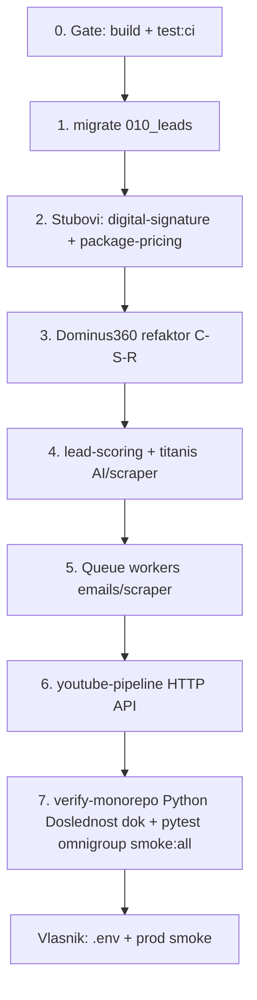

# Agent(i) — kompletna checklista (sve što agent mora uraditi)

**Repo:** `c:\Users\Marko Kosic\OneDrive\Desktop\omni group`  
**Izvor:** Master audit 2026-05-20 + [`AGENT-HANDOFF-OSTALO.md`](./AGENT-HANDOFF-OSTALO.md) + [`CHECKLIST-CEO-SISTEM.md`](../CHECKLIST-CEO-SISTEM.md)  
**Politika:** Ne pokretati Cursor Task talase D–I automatski. Rad u repou, disjunktne granice po agentu (max 3–4 paralelno).

**Legenda:** `[x]` urađeno · `[ ]` agent radi · `[V]` **samo vlasnik** (ključevi, GitHub prod, live plaćanja)

---

## 0. Pre svakog PR-a (svi agenti)

- [x] `python -m pytest -q` (koren) — 11 passed (2026-05-21)
- [x] `cd atina-platform/atina` → `npm run build` + `npm run test:ci` — **3162** testova, coverage gate OK (2026-05-20)
- [x] `cd atina-system` → `npm run verify:n1` (bez PG) — **140/140** (2026-05-21); `verify:ci` = opciono sa Postgres
- [x] Pun mirror: `verify-monorepo.ps1` — **Val 357** / 2026-05-21, exit 0, ~734 s → [`NIVO-1-VERIFY-MONOREPO-EVIDENCE-LATEST.md`](./NIVO-1-VERIFY-MONOREPO-EVIDENCE-LATEST.md) (job **`python`** / **`Python (Doslednost dok + pytest)`** — [`GIT-BRANCH-PROTECTION.md`](./GIT-BRANCH-PROTECTION.md); **`apps/omnigroup-web`**; **`npm run smoke:all`**)
- [ ] **Ne commitovati** `atina-platform/atina/.env`

---

## 1. Agent 04 — Node jezgro (`core`, `config`, `integrations`, `queue`)

**Granica:** `atina-platform/atina/src/{core,config,integrations,queue,utils}` — **bez** `src/modules/**`

| # | Zadatak | Status |
|---|---------|--------|
| 1.1 | `CoreEngine` + `ModuleRegistry` — registracija svih modula | [x] |
| 1.2 | `process.env.PHASE` + sync u DB + gating (`billing`, `crm`, `analytics`…) | [x] 2026-05-20 |
| 1.3 | `ModuleRegistry.registerHealthProbe` — bez admin→forge cross-import | [x] 2026-05-20 |
| 1.4 | 7 agregatora + `CAPTCHA_*`, `DOMAIN_*`, `WEB3_STORAGE_*` u `config` | [x] 2026-05-20 |
| 1.5 | `AggregatorHttpClient` — exponential backoff (4 pokušaja) | [x] 2026-05-20 |
| 1.6 | Klijenti: `captcha-client`, `domain-client`, `web3-storage-client` + testovi | [x] |
| 1.7 | `utils/sofra-tax.ts` (SOFRA / X-Road simulacija) | [x] 2026-05-20 |
| 1.8 | Migracija `010_leads_compat_view.sql` (view `leads`) | [x] — lokalno `npm run migrate` 2026-05-21; staging/prod = vlasnik |
| 1.9 | PayPal/Wise kroz `FINANCE` agregator (ne samo direktni env) | [x] 2026-05-20 |
| 1.10 | `emails` / `scraper` Bull workeri — registrovati procesore (ne samo `tasks`) | [x] 2026-05-20 |
| 1.11 | Dok: ažurirati [`AGENT-HANDOFF-OSTALO.md`](./AGENT-HANDOFF-OSTALO.md) posle Val test:ci | [x] 2026-05-21 § Audit + C-S-R platform moduli |

---

## 2. Agent 07 — Ecosystem moduli (CEO § E + audit)

**Granica:** po modulu jedan folder `src/modules/<slug>/` — **ne dirati** tuđe slug-ove u istom PR-u.

### 2.1 Prioritet 1 — produkcioni lanac (već delimično urađeno)

| Modul | Šta agent radi | Status |
|-------|----------------|--------|
| **craftor** | AI na proposal/humanization + SOFRA u run payload | [x] 2026-05-20 |
| **client-hunter** | Scraper na Upwork/Fiverr/LinkedIn kad je `SCRAPER_*` | [x] 2026-05-20 |
| **omnitube** | `task-executors` + AI skripta + queue `omnitube_pipeline` | [x] 2026-05-20 |
| **omnigame** | Steam scrape put + `omnigame_validate` task | [x] 2026-05-20 |
| **apex-predator** | Fan DNA (`ai.remember`), chargeback payload, suicide switch env | [x] 2026-05-20 |
| **lead-scoring** | `getAiClient()` na `rank` mod (kao craftor) | [x] 2026-05-20 |
| **titanis** | Opcioni scraper/AI na run (ne samo heuristika) | [x] 2026-05-20 |
| **outreach / follow-up** | COMMS agregator za slanje (pored SMTP) | [x] 2026-05-20 |

### 2.2 Prioritet 2 — refaktor arhitekture (Clean Architecture)

| Modul | Problem | Zadatak agenta |
|-------|---------|----------------|
| **dominus360** | Logika u `dominus360.module.ts` + direktan `query()` | [x] C-S-R + AI risk-scan 2026-05-20 |
| **digital-signature** | Stub fajl | [x] C-S-R + BUSINESS_AND_DEV opcija 2026-05-20 |
| **package-pricing** | Stub fajl | [x] C-S-R (logika u service + stub compute) 2026-05-20 |
| **recommendation / ai-memory** | AI poziv u `.module.ts` | [x] C-S-R + AI u service 2026-05-20 |

### 2.2b Platform moduli — C-S-R (SaaS jezgro)

| Modul | Šta | Status |
|-------|-----|--------|
| **billing** | `billing.repository.ts` — planovi, fakture, limiti | [x] 2026-05-21 |
| **payments** | `payments.repository.ts` — DB preko `execute`/`runInTransaction` | [x] 2026-05-21 |
| **resource-management** | `resource-management.repository.ts` — budget/ROI/logs | [x] 2026-05-21 |
| **phase-launch** | `phase-launch.repository.ts` — flag + audit | [x] 2026-05-21 |
| **tasks / workflow-chain** | Faza 4 | [x] 2026-05-21 |

**Preostalo (niski prioritet):** `self-healing`, `ai-memory` (SQL još u service), `admin.service` split.

### 2.3 Prioritet 3 — ostali ecosystem (partial → bolje)

| Modul | Dok (wave) | Agent zadatak | Status |
|-------|------------|---------------|--------|
| **dominus360** | 3 moda + stage v1/v2 | Testovi posle refaktora; opcioni AI risk preko `AI_*` | [x] 2026-05-20 |
| **titan-master** | Strategic engine | Opcioni `getAiClient` za preporuke | [x] 2026-05-20 |
| **titanix** | Pipeline + Bull | Potvrditi `titanix_pipeline` u workeru (već u `tasks`) | [x] |
| **deal-offer, validator, proxy-rotation** | Ecosystem run | Idempotency + agregatori: deal-offer COMMS/AI, validator AI enrich, proxy SCRAPER + idempotency | [x] 2026-05-21 |
| **integration-hub** | Nango sync | Dokumentovati kada `BUSINESS_AND_DEV_*` obavezan | [x] wiring |

**Test po modulu:** `src/tests/unit/<slug>.*.test.ts` + `*.module.routes.test.ts` — mora ostati zeleno.

---

## 3. Agent 03 — Nest (`atina-system`)

| # | Zadatak | Status |
|---|---------|--------|
| 3.1 | Supply Core: vault + heartbeat cron | [x] |
| 3.2 | `process.env.PHASE` u Nest (`phase.service.ts`) | [x] |
| 3.3 | `supply-core*.spec.ts` — unit testovi za heartbeat | [x] 2026-05-21 (`verify:n1` 140/140) |
| 3.4 | Produkcija: migracije umesto `TYPEORM_SYNC` — runbook za vlasnika | [V] evidencija: [`TYPEORM-PROD-EVIDENCE-LATEST.md`](./TYPEORM-PROD-EVIDENCE-LATEST.md) |

---

## 4. Agent 02 — Python (Astra / Forge / Atina worker)

| # | Zadatak | Status |
|---|---------|--------|
| 4.1 | `pytest` koren (11+) | [x] |
| 4.2 | Vault alignment Python ↔ Node Forge — [`VAULT-ALIGNMENT-NOTES.md`](./VAULT-ALIGNMENT-NOTES.md) | [x] 2026-05-21 § Staging model |
| 4.3 | `tools/youtube-pipeline` — HTTP API za `YOUTUBE_PIPELINE_URL` (Node poziva) | [x] 2026-05-20 |

---

## 5. Agent 06 — Smoke, skripte, CI

| # | Zadatak | Status |
|---|---------|--------|
| 5.1 | `scripts/check-atina-aggregators.ps1` — proširiti za CAPTCHA/DOMAIN/WEB3 | [x] 2026-05-20 |
| 5.2 | `scripts/check-stripe-env.ps1` — FINANCE + Stripe polja | [x] 2026-05-21 (+ opcioni PayPal/Wise) |
| 5.3 | Lokalno: `smoke-stack.ps1` tri stuba — [`NIVO-1-SMOKE-EVIDENCE-LATEST.md`](./NIVO-1-SMOKE-EVIDENCE-LATEST.md) | [x] Val 351 |
| 5.4 | Posle vlasnikovog deploy: `npm run smoke:all` na prod URL | [V] |
| 5.5 | GitHub `ci-monorepo.yml` zelen na `main` posle push | [V] + agent runbook [`CI-GREEN-ON-MAIN.md`](./CI-GREEN-ON-MAIN.md) |

---

## 6. Agent 05 — Ops dokumentacija

| # | Zadatak | Status |
|---|---------|--------|
| 6.1 | [`production-config-matrix.md`](../atina-platform/atina/docs/operations/production-config-matrix.md) — nova env polja (PHASE, CAPTCHA, YOUTUBE_PIPELINE, APEX_*) | [x] 2026-05-20 |
| 6.2 | [`deploy-rollback-checklist.md`](../atina-platform/atina/docs/operations/deploy-rollback-checklist.md) — migrate `010` | [x] 2026-05-20 |
| 6.3 | Audit izveštaj SR u [`AGENT-HANDOFF-OSTALO.md`](./AGENT-HANDOFF-OSTALO.md) § „Audit 2026-05-20“ | [x] 2026-05-21 |

---

## 7. Agent 08 — Next (`apps/omnigroup-web`)

| # | Zadatak | Status |
|---|---------|--------|
| 7.1 | Build prolazi (D.1 placeholder) | [x] |
| 7.2 | Restore pravi UI sa OneDrive — [`OMNIGROUP-WEB-EMPTY-FILES-RUNBOOK.md`](./OMNIGROUP-WEB-EMPTY-FILES-RUNBOOK.md) | [V] build prolazi sa D.1 placeholder (Iter 2); pravi UI = OneDrive/Git restore |
| 7.3 | Resend kontakt forma — `.env.local` | [V] + agent skripta `test-contact-resend.ps1` |

---

## 8. Agent 09 — PDF / Nivo 3 (dokumentacija, ne izmišljati feature)

| # | Zadatak | Status |
|---|---------|--------|
| 8.1 | Ažurirati [`nivo3-wave-a/04-craftor-supply-dominus.md`](./nivo3-wave-a/04-craftor-supply-dominus.md) — integracije 2026-05-20 | [x] 2026-05-21 |
| 8.2 | Tabela „partial vs aligned“ za OmniTube/OmniGame/Apex posle izmena | [x] 2026-05-21 (§ u `04` + `05-omnitube-apex.md`) |
| 8.3 | **Ne** označavati Flux/125k/LivePortrait kao aligned dok nema koda | [x] pravilo |

---

## 9. Šta agent **ne može** zameniti (vlasnik `[V]`)

Kopija: [`CEO-OPEN-BULLETS-RUNBOOK.md`](./CEO-OPEN-BULLETS-RUNBOOK.md) · [`VLASNIK-PAKET.md`](./VLASNIK-PAKET.md)

| # | Vlasnik |
|---|---------|
| V.1 | Popuniti `atina-platform/atina/.env` (AI, SCRAPER, FINANCE, COMMS, …) |
| V.2 | GitHub: `main` zaštita + prvi push |
| V.3 | CEO §G: prod build, staging, live Stripe/PayPal, SMTP, `smoke:all` na prod |
| V.4 | Disk ≥5 GB pre punog `verify-monorepo` (job **`python`** / **`Python (Doslednost dok + pytest)`** — [`GIT-BRANCH-PROTECTION.md`](./GIT-BRANCH-PROTECTION.md); **`apps/omnigroup-web`**; **`npm run smoke:all`**) |
| V.5 | Nest prod: `TYPEORM_SYNC=false` + migracije na pravoj bazi |
| V.6 | _(opciono)_ D.1 restore pravog `omnigroup-web` UI (OneDrive / Git) |

**Kad vlasnik popuni `.env`**, agent pokreće:

```powershell
cd "c:\Users\Marko Kosic\OneDrive\Desktop\omni group"
.\scripts\check-atina-aggregators.ps1
.\scripts\check-stripe-env.ps1
cd atina-platform\atina
npm run migrate
npm run smoke:all
```

---

## 10. Redosled rada (preporuka za jednog agenta)



1. **Dan 1:** `test:ci` 100% + `migrate` + stubovi → puni moduli  
2. **Dan 2:** Dominus refaktor + lead-scoring/titanis integracije  
3. **Dan 3:** Queue + youtube API + ops docs + novi Val  
4. **Posle vlasnika:** smoke prod + CEO evidencija  

---

## 11. Definicija „agent je završio sve“

**Status 2026-05-21:** kriterijumi ispunjeni — sekcije **1–8** zatvorene (§7.2 = `[V]`). Novi agent radi samo ako vlasnik traži feature ili posle popunjenog `.env` (ponoviti smoke / integracije).

- `npm run test:ci` — **3170/3170**, coverage ≥90%
- `verify-monorepo.ps1` — **Val 357**, exit 0
- `verify-agent-handoff.ps1` — PASS
- [`AGENT-HANDOFF-OSTALO.md`](./AGENT-HANDOFF-OSTALO.md) i ovaj fajl ažurirani

**„Ceo Titan Blueprint 100% uživo“** = agent + vlasnik; PDF partial ostaje dok nema live ključeva i infrastrukture (Flux, K8s, 125k profila).

---

## 12. Vlasnik — sledeći koraci (redom)

| # | Akcija | Dokument / komanda |
|---|--------|-------------------|
| 1 | Commit + push (~117 fajlova) | [`GITHUB-PUSH-READY.md`](./GITHUB-PUSH-READY.md) · `.\scripts\stage-master-blueprint.ps1` · `.\scripts\verify-agent-handoff.ps1` |
| 2 | Popuniti `.env` agregatore + Stripe | `.\scripts\check-atina-aggregators.ps1` · `.\scripts\check-stripe-env.ps1` |
| 3 | Posle deploya: `npm run smoke:all` na prod URL | [`VLASNIK-PAKET.md`](./VLASNIK-PAKET.md) Korak 3 |
| 4 | _(opciono)_ D.1 restore pravog omnigroup-web UI | [`OMNIGROUP-WEB-EMPTY-FILES-RUNBOOK.md`](./OMNIGROUP-WEB-EMPTY-FILES-RUNBOOK.md) |

---

## Reference

| Dokument | Uloga |
|----------|--------|
| [`AGENT-RADNI-PLAN.md`](../AGENT-RADNI-PLAN.md) | Raspodela agent 01–10 |
| [`AGENT-HANDOFF-OSTALO.md`](./AGENT-HANDOFF-OSTALO.md) | Handoff + šta je već [x] |
| [`CHECKLIST-CEO-SISTEM.md`](../CHECKLIST-CEO-SISTEM.md) | CEO matrica (10 otvorenih = vlasnik) |
| [`NIVO-2-CEO-D-TRACE.md`](./NIVO-2-CEO-D-TRACE.md) | 50 modula trag |
| [`nivo3-wave-a/04-craftor-supply-dominus.md`](./nivo3-wave-a/04-craftor-supply-dominus.md) | Craftor + Dominus + Supply |

*Poslednja izmena checkliste: 2026-05-21 (agent zatvoren; Val 357 verify).*
