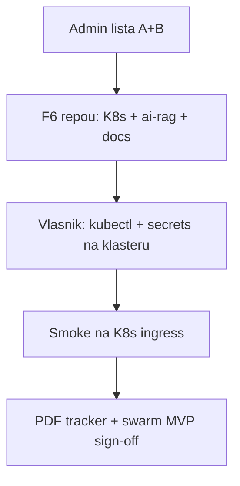

# Faza 6 — START (K8s + pun AI + PDF dubina + swarm)

**Status repoa:** **Faza 6 započeta** (2026-05-25) — infrastruktura + moduli u repou; **live klaster** = vlasnik posle admin liste.

**Ulaz:** završena ili paralelna [`ADMIN-KOMPLET-100-LISTA.md`](./ADMIN-KOMPLET-100-LISTA.md) (operativni SaaS 100% A+B).

---

## Šta Faza 6 dodaje na postojeći monorepo

| Epic | Lokacija | Opis |
|------|----------|------|
| **F6-K8s** | [`infra/k8s/`](../infra/k8s/) | Kustomize: Atina SaaS + Nest API + omnigroup-web + Postgres + Redis |
| **F6-OBS** | [`infra/observability/`](../infra/observability/) | Prometheus/Grafana runbook (opciono Helm values) |
| **F6-RAG** | `atina-platform/atina/src/modules/ai-rag/` | RAG ingest + search (DB `ai_rag_chunks`) |
| **F6-SWARM** | `dominus-swarm` task + [`FAZA-6-DOMINUS-SWARM.md`](./FAZA-6-DOMINUS-SWARM.md) | Koordinacija sa `scaling` modulom (MVP, ne 125k live) |
| **F6-PDF** | [`FAZA-6-PDF-ALIGNMENT-TRACKER.md`](./FAZA-6-PDF-ALIGNMENT-TRACKER.md) | Stranični aligned tracker |
| **F6-PLAN** | [`FAZA-6-BACKLOG.md`](./FAZA-6-BACKLOG.md) · [`FAZA-6-IMPLEMENTATION-PLAN.md`](./FAZA-6-IMPLEMENTATION-PLAN.md) | Backlog + sprintovi |

---

## Redosled rada

1. Pročitaj [`FAZA-6-IMPLEMENTATION-PLAN.md`](./FAZA-6-IMPLEMENTATION-PLAN.md).
2. Deploy K8s: [`infra/k8s/README.md`](../infra/k8s/README.md) + `.\scripts\deploy-k8s.ps1 -Overlay staging`.
3. Migracija: `npm run migrate` (ukl. `012_ai_rag_chunks.sql`).
4. Test RAG: `POST /api/v1/ai-rag/ingest`, `GET /api/v1/ai-rag/search`.
5. PDF aligned: popunjavaj [`FAZA-6-PDF-ALIGNMENT-TRACKER.md`](./FAZA-6-PDF-ALIGNMENT-TRACKER.md).

---

## Gate (Faza 6 zatvorena u repou)

- [x] F6 unit testovi (`ai-rag`, `dominus-swarm`, `execute-task-by-type`) PASS lokalno
- [ ] `npm run test:ci` pun PASS
- [ ] `kubectl apply -k infra/k8s/overlays/staging` uspešno (vlasnik)
- [ ] `GET /health` na ingress URL
- [ ] RAG ingest + search jedan E2E tok dokumentovan
- [ ] PDF tracker: svi moduli iz Master Spec imaju status aligned / partial / N/A

---

## Reference

| Dokument | Uloga |
|----------|--------|
| [`NIVO-3-VISION-K8S-AI.md`](./NIVO-3-VISION-K8S-AI.md) | V.1 / V.2 mapa |
| [`MASTER-WORK-LIST.md`](../MASTER-WORK-LIST.md) red #19 | Master red Faza 6 |
| [`PUT-NA-100-PLAN.md`](./PUT-NA-100-PLAN.md) | Opseg A+B vs F6 |
