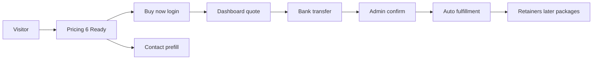

# Vrhunski plan marketinga — Omni Group Tech

Kanonski GTM / marketing plan usklađen sa **stvarnim M0 stanjem** u kodu: 6 sellable paketa, manuelni checkout, automatski fulfillment. Ne oversell-uje autonomiju, Stripe live ni outbound dok gate nije zelen.

**Princip:** Prodaj ono što možeš isporučiti danas. Faze M1–M6 pale kanale tek posle merljivih gate-ova.

Povezano: [`MARKETING-REVENUE-PHASED-CHECKLIST.md`](./MARKETING-REVENUE-PHASED-CHECKLIST.md) · [`FULFILLMENT-17-PACKAGE-CHECKLIST.md`](./FULFILLMENT-17-PACKAGE-CHECKLIST.md) · [`VLASNIK-DOSTAVA.md`](./VLASNIK-DOSTAVA.md) · [`TEST-PLAN-KOMPLETAN.md`](./TEST-PLAN-KOMPLETAN.md) · [`SYSTEM-MAP.md`](../SYSTEM-MAP.md) · brand [`apps/omnigroup-web/src/lib/brand.ts`](../apps/omnigroup-web/src/lib/brand.ts) · ponude [`client-offers.ts`](../apps/omnigroup-web/src/lib/client-offers.ts) · cene [`package-delivery-spec.ts`](../apps/omnigroup-web/src/lib/package-delivery-spec.ts)

---

## 1. Positioning i poruka

### Brand

| Sloj | Ime | Uloga u komunikaciji |
|------|-----|----------------------|
| Brand | **Omni Group Tech** | Jedini hero signal na marketing surface-u |
| Modul | Atina | API & SaaS core (podsistem, ne zamena brenda) |
| Modul | Astra | Automation & workflows |
| Modul | Titan | Operations & integrations |

Sajt: `https://omnigrouptech.com` · API: `https://api.omnigrouptech.com`

### Core promise (EN, public)

> **Turnkey digital delivery** — CRM setup, site, workflows, and support as finished output. Transparent pricing. No platform resale.

Srpski (ops / lokalni outreach kasnije):

> Gotova isporuka za tvoj biznis — CRM setup, sajt, workflowi i podrška. Jasna cena. Ne prodajemo „platformu“, nego završen rezultat.

### Anti-promise (ne govoriti dok gate nije PASS)

| Ne obećavaj | Zašto | Kad sme |
|-------------|-------|---------|
| „Self-running / autonomous growth engine“ | `autonomy-loop` namerno off do M5 | M5+ MRR ≥ €1500 |
| „Pay by card / Stripe live“ | Manuelni bank transfer do M6 | M6 + Stripe keys + Price IDs |
| „Guaranteed leads / meetings“ | `lead-gen-retainer` eksplicitno bez garancije | Nikad kao garancija; M4 kao retainer |
| „24/7 human support“ | Spec: 24h response (`support-priority`), bez weekend emergency SLA | Nikad; koristi „24h response target“ |
| „907 proven industry solutions“ | Thin boilerplate verticals, ne case studies | Tek posle premium nich content + dokaz |
| Premium avatar / HeyGen video | Ključevi pending | Posle DID/HeyGen + M3 retainer |

### Ispravke homepage claimova (backlog copy)

| Trenutno (problem) | Ispravka |
|--------------------|----------|
| `Industries online 25+` | Uskladiti sa **50 kategorija** / ukloniti broj ili reći „industry catalog“ bez lažne preciznosti |
| `Support 24/7 AI` | „Priority support · 24h response target“ (usklađeno sa package spec) |
| Logo marquee Atina/Astra/Titan/Forge | Nije social proof — ukloniti ili zameniti pravim klijentima kad postoje |

---

## 2. ICP i prioritetni vertikale (90 dana)

### Primarni ICP

- **Ko:** SMB / lokalni i regionalni biznisi (1–50 zaposlenih) kojima treba sajt, onboarding CRM-a, mapirani procesi i mesečna podrška
- **Nije:** Enterprise „platforma“, unbounded custom build, ili kupci koji traže instant card SaaS subscription kao jedini model
- **Buyer:** vlasnik / marketing lead / ops lead
- **Trigger:** nemaju sajt ili zastareo; žele CRM/setup bez zaposlenog developera; žele gotov landing za nišu

### Geografija

| Surface | Jezik | Napomena |
|---------|-------|----------|
| Public marketing (`omnigrouptech.com`) | English | Primarni GTM |
| Ops, admin, vlasnik dokovi | Srpski | Interna istina |
| Outbound (M2+) | SR lokalno + EN za global niches | `hunt-locales` + EN templates |

### Top 5 kategorija (fokus — ne svih 907)

| Kategorija | Zašto | Primarni paket |
|------------|-------|----------------|
| `home_services` | Visok intent, lokalni SMB, brza landing/website isporuka | `landing` / `website-business` |
| `professional` | Konsultanti, agencije — audit + setup fit | `audit` + `setup-quick` |
| `healthcare` | Potreba za jasnim sajtom + procesima (bez medicinskih claimova) | `website-business` + `workflow-design` |
| `hospitality` | Sezonski demand, booking/kontakt fokus | `landing` + `support-priority` |
| `construction` | Lokalni projekti, trust + portfolio-style site | `website-business` |

Ostalih 902 vertical stranica: ostaju u katalogu, ali **ne** nose paid/outbound fokus dok nema premium copy po nichu.

---

## 3. Offer architecture

### Prodaj SADA (M0 budget-launch — 6 paketa)

| ID | Ime | Billing | Anchor € | Promise (skraćeno) |
|----|-----|---------|----------|-------------------|
| `setup-quick` | Quick setup | one-time | 249 | Client portal ready · 1–2 dana |
| `audit` | Technical audit | one-time | 349 | Tehnički izveštaj · ~48h |
| `workflow-design` | Workflow design | one-time | 449 | Procesi → plan · 2–3 dana |
| `landing` | Landing + copy | one-time | 549 | Live landing · 2–4 dana |
| `website-business` | Business website | one-time | 990 | Multi-page site · 5–7 dana |
| `support-priority` | Priority support | monthly | 99 | Priority help · 24h target |

Ostalih 11 paketa: badge **Currently under construction** / „Notify me when ready“ — iskreno, ne sakrivati.

### Funnel

1. **Hero:** `/pricing` → Buy now → login → dashboard quote → bank transfer → admin confirm → auto fulfill  
2. **Secondary:** `/contact?service=…` (prefill iz OfferCard)  
3. **Portal:** `/login` za postojeće klijente · `/dashboard#quote`

### Bundle predlozi (sales copy, ne obavezno novi SKU)

| Bundle | Sastojci | Zašto |
|--------|----------|-------|
| Start clean | Audit + Quick setup | Dijagnoza pa portal |
| Niche launch | Landing + Support | Brzi go-live + retainer |
| Business base | Website + Support | Najviši AOV u M0 setu |

### Upsell mapa po fazama

| Faza | Otključava (primer) | Marketing potez |
|------|---------------------|-----------------|
| M1 | `setup-full` (€690) | Posle prve uplate / Resend inbound |
| M2 | `vertical-package`, `support-dedicated`, `integration` | Warm outbound + vertical CTA |
| M3 | `ai-support-retainer`, ecommerce, custom-software | Case studies + upsell email |
| M4 | `lead-gen-retainer` | Lead mašina; bez guarantee meetings |
| M5–M6 | Autonomy spend, Stripe | Tek posle MRR gate-ova |

---

## 4. Kanali po fazama (M0 → M6)

Usklađeno sa [`MARKETING-REVENUE-PHASED-CHECKLIST.md`](./MARKETING-REVENUE-PHASED-CHECKLIST.md). **Ne pali kanal pre gate-a.**

| Faza | Marketing fokus | Gate pre paljenja |
|------|-----------------|-------------------|
| **M0** | Sajt + manuelni sales + referral / DM | Prva potvrđena uplata + smoke |
| **M1** | Inbound: contact → Resend + Slack/Telegram + CRM | DNS `api.` + Resend domain verified + CONTACT_* |
| **M2** | Warm outbound: scrape + **draft** + domain warmup (bez spam blast) | `SCRAPER_KEY` + warmup OK |
| **M3** | Case studies iz isporučenih paketa + retainer upsell | 3× fulfilled + javni URL |
| **M4** | Lead mašina: Hunter + outreach send + KPI | MRR gate + positive ROI |
| **M5** | Autonomy micro-spend po vertikali | MRR ≥ €1500 + budget reserve |
| **M6** | Stripe live, premium avatar, pun gas | MRR ≥ €2000 + Stripe keys |

### Kanal pravila

- **M0–M1:** ljudski closing; sajt radi poverenje i checkout instrukcije  
- **M2:** samo draft + warmup; dnevni cap po `OUTREACH_DAILY_CAP`  
- **M4:** merljivi KPI pre skaliranja spend-a  
- **M5+:** micro-boost samo kad revenue feedback loop radi  

Pre bilo koje javne kampanje: proći relevantne nivoe iz [`TEST-PLAN-KOMPLETAN.md`](./TEST-PLAN-KOMPLETAN.md) (bar L2 smoke + L3 billing/fulfillment ako dira novac).

---

## 5. Funnel i konverzija — P0 backlog (web)

Dokumentuje rupe; **implementacija UI-a nije deo ovog dokumenta** (radi se kad zatražiš).

| Prioritet | Stavka | Zašto |
|-----------|--------|-------|
| P0 | Ukloniti lažni logo wall (interna imena) | Lažni social proof šteti trustu |
| P0 | OpenGraph / Twitter + `metadataBase` | Share preview trenutno prazan |
| P0 | `manifest.json` — public brand, ne `/admin/mobile` | PWA install vodi u operator konzolu |
| P0 | Analytics (Plausible ili GA4) | Bez merenja M4 KPI sa weba ne postoje |
| P0 | CTA „Book a call“ → calendar URL ili ostaje contact | Dead-end ako nema Meet/Cal link |
| P1 | Homepage stats uskladiti sa SLA / katalogom | Sprečava overclaim |
| P1 | Cookie / counsel-approved legal | Template legal nije binding |
| P1 | Company identity na fakturama (`companyLegalName`, tax ID) | Profesionalni checkout |

Vlasnik blocker lista (DNS, Resend, Slack): [`VLASNIK-DOSTAVA.md`](./VLASNIK-DOSTAVA.md).

---

## 6. Content / SEO

### Tehnički SEO (backlog)

- `metadataBase` + `alternates.canonical` na marketing rutama  
- Sitemap: uključiti `/legal/*`, `/invoices/preview`; revidirati `SOLUTION_SITEMAP_CAP = 500` vs 907 stranica  
- JSON-LD: `Organization` + `Offer` za **6 ready** paketa (ne svih 17 under construction)  
- Robots/sitemap: nikad fallback `https://omnigroup.example` u prod build-u (`NEXT_PUBLIC_SITE_URL` obavezan)

### Content prioritizacija

1. **Trust pages (kratko):** About, FAQ, How we deliver (process) — bez dashboard-kartica u hero-u  
2. **Premium verticali:** 1 po fokus nichu iz Top 5 (diferencirana copy, FAQ, dokaz) — ne boilerplate × 907  
3. **Case studies (M3):** iz stvarnih fulfillment artefakata (URL, vreme isporuke, paket) — bez izmišljenih testimonials  
4. **Invoice preview:** dodati CTA nazad u `/pricing` ili `/contact` (trenutno trust bez izlaza)

### Jezik

- Public: English (postojeći sajt)  
- Ne uvoditi locale routing u ovom planu dok M0–M1 nisu stabilni; SR outbound copy živi u hunter/templates

---

## 7. 90-dnevni kalendar

### W1–2 — Trust + prva naplata (M0 → M1 gate)

- Vlasnik: DNS `api.omnigrouptech.com`, Resend domain verify, CONTACT_FROM/TO  
- Copy backlog: anti-overclaim na homepage (stats, logo wall) — kad se radi web sprint  
- Cilj: **1 confirmed production payment** + zelen smoke  
- Manuelni sales: 10–20 personalizovanih DM/email (ne blast) ka Top 5 nichu

### W3–4 — Dokaz i AOV

- 3 interna „case notes“ iz fulfillment output-a (čak i ako još nisu public page)  
- Sales skripta za bundle (Audit+Setup, Landing+Support, Website+Support)  
- Provera: OfferCard honesty (`notIncluded`) ostaje vidljiva

### W5–8 — Inbound higijena + 1 vertikalni sprint

- M1: contact → CRM → Slack/Telegram pouzdano  
- Jedan premium vertical landing (jedan slug iz Top 5)  
- Meriti: contact submit rate, time-to-first-response (&lt; 1 business day kako piše na contact)

### W9–12 — Warm outbound samo posle gate-a

- Ako M2 gate zelen: scrape + **draft** + warmup; inače ostani na inbound + referral  
- KPI review: AOV, broj confirmed payments, support churn  
- Ne skalirati paid ads / autonomy dok M4/M5 nisu otvoreni

---

## 8. KPI

| Faza | KPI | Cilj |
|------|-----|------|
| M0 | Confirmed production payments | ≥ 1 |
| M0 | Site / smoke | zelen (vidi test plan L2) |
| M1 | Inbound lead u CRM | ≥ 1 sa Resend live |
| M1 | Email delivery | &gt; 95% (Resend dashboard) |
| M3 | Fulfilled packages | ≥ 3 + javni URL dokaz |
| M4 | Leads enriched / week | ≥ 20 |
| M4 | Outbound sent / day | ≤ `OUTREACH_DAILY_CAP` |
| M4 | Reply rate | ≥ 2% |
| M4 | Manual checkout / month | ≥ 2 |
| M4 | Cost per lead | &lt; €5 |
| M5 | Estimated MRR | ≥ €1500 |
| M6 | Estimated MRR | ≥ €2000 |

Auto-unlock (kod): `factory-phase-effective.ts` — M1 = prva uplata; M2 = MRR ≥ €200 ili revenue ≥ €800; itd. Marketing ne „proglašava“ fazu pre metrics/keys.

---

## 9. Messaging cheat sheet (copy-paste)

### Hero (predlog usklađen sa M0)

- **H1:** Custom software and automation delivered for your business  
- **Sub:** You get finished output — portal setup, site, workflows, support — with clear package pricing. Payment by bank transfer; delivery starts after confirmation.  
- **CTA primary:** See packages (`/pricing`)  
- **CTA secondary:** Start a project (`/contact`)

### One-liner za outbound draft (M2+)

> I help teams get finished delivery (CRM setup, landing/site, workflows) — not a SaaS subscription. Package from €249; transparent includes/excludes.

### Odgovor na „imate li AI autonomiju?“

> Under the hood we automate fulfillment after payment. Growth automation and outbound scale only after delivery quality and revenue gates — we don’t switch that on blindly.

---

## 10. Prodaj / kasnije / ne obećavaj (sažetak)

| Prodaj SADA | Prodaj pažljivo (faza+) | Ne obećavaj |
|-------------|-------------------------|-------------|
| 6 M0 paketa | `setup-full`, vertical, dedicated support | Autonomy growth engine |
| Bank transfer + admin confirm | Lead-gen retainer (bez guarantee) | Stripe live danas |
| Auto fulfill posle confirm | AI support retainer (posle keys) | 24/7 human SLA |
| Honest „under construction“ | Warm outbound draft | 907 proven case studies |
| Contact &lt; 1 business day | Case studies posle 3× fulfill | Counsel-ready legal već važi |

---

## 11. Definition of Done — ovaj plan

- [x] Dokument postoji kao kanonski GTM izvor  
- [ ] Vlasnik zatvorio M1 keys (DNS + Resend) — van dokumenta  
- [ ] Prva confirmed payment  
- [ ] P0 web trust/SEO backlog odrađen u posebnom sprintu  
- [ ] M2+ kanali pale se samo uz gate iz phased checkliste  

**Formalni ops gate po fazama:** uvek [`MARKETING-REVENUE-PHASED-CHECKLIST.md`](./MARKETING-REVENUE-PHASED-CHECKLIST.md).  
**Kvalitet pre kampanje:** [`TEST-PLAN-KOMPLETAN.md`](./TEST-PLAN-KOMPLETAN.md).
