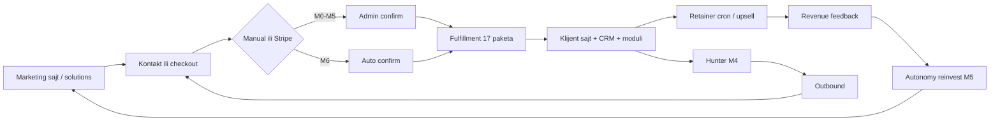

# Marketing & revenue — fazno paljenje (M0 → M6)

**Cilj:** Sistem koji ** štampa pare** — svaka faza pali samo ono što donosi novac uz kontrolisan rizik i budžet.  
**Princip:** Ne pali sve odjednom. Svaka faza ima **gate** (merljiv uslov), **env blok**, **module stack** i **verify skripte**.

**Izvori istine u kodu:**

| Domen | Fajl / modul |
|-------|----------------|
| Lead DB F0–F5 | `integrations/lead-databases/phased-rollout.ts`, [`LEAD-DATABASES-PHASED.md`](../atina-platform/atina/docs/operations/LEAD-DATABASES-PHASED.md) |
| Autonomy + marketing spend | `autonomy-marketing.service.ts`, `autonomy-orchestrator.service.ts` |
| Outbound | `outreach` modul, `OUTREACH_*` env |
| Javni sajt | `apps/omnigroup-web/(marketing)/`, `public-site` modul |
| Fulfillment paketi | `deliverable-handlers/`, [`FULFILLMENT-17-PACKAGE-CHECKLIST.md`](./FULFILLMENT-17-PACKAGE-CHECKLIST.md) |
| Ključevi | `atina-platform/atina/KLJUCEVI-POPUNI.local.txt` → `scripts/apply-integration-keys.ps1` |

**Legenda:** `[x]` spremno u kodu · `[ ]` tvoj korak · `[~]` delimično · **Gate** = mora proći pre sledeće faze

---

## Mapa faza (pregled)

```
M0  Novac SADA     manual checkout + fulfillment 17 + prod sajt
      ↓ Gate: prva potvrđena uplata + smoke 32/32
M1  Inbound         kontakt forma, Slack, Telegram, admin panel
      ↓ Gate: Resend live + prvi inbound lead u CRM
M2  Warm outbound   scrape + draft + warmup (bez spam rizika)
      ↓ Gate: domen warmup završen ILI dev fallback test OK
M3  Deliver & upsell  klijentski sajtovi, retainer cron, sales enablement
      ↓ Gate: 3× fulfilled paket + javni URL (DNS api)
M4  Lead mašina     LEAD F3–F4, hunter, CRM, Titanis, outreach send
      ↓ Gate: MRR ≥ cilj + positive ROI na lead spend
M5  Autonomy reinvest  vertikale, marketing micro-spend, sync katalog
      ↓ Gate: revenue feedback loop + budžet reserve OK
M6  Pun gas         Stripe live, LEAD F5, avatar premium, OmniTube
```

**Paralelno (ne blokira M0–M3):** HeyGen/D-ID, Slack webhook — uključi čim imaš ključeve (pojačava konverziju, nije gate za M0).

---

## Modul stack po sloju

| Sloj | Moduli | Paljenje |
|------|--------|----------|
| **Prikaz (web)** | `(marketing)/`, `marketing-catalog.ts`, `generated-verticals-index.json` | M0 — već live |
| **Javni tenant sajtovi** | `public-site`, `ClientSiteView`, `/sites/[slug]` | M3 — sadržaj posle fulfillment |
| **Prodaja (inbound)** | `payments`, `billing`, BFF checkout, `AdminPendingPaymentsPanel` | M0 |
| **Isporuka** | `deliverable-fulfillment`, 17 handlera, `retainer-scheduler` | M0–M3 |
| **Lovec** | `client-hunter`, `scraper`, `hunting-stack` | M2+ |
| **Lead DB** | `lead-databases/*`, phased F0–F5 | M4 (F3+) |
| **CRM + scoring** | `crm`, `lead-scoring`, `hot-clients` | M1 inbound, M4 outbound |
| **Outbound** | `outreach`, `follow-up`, `follow-up-automation` | M2 draft, M4 send |
| **Sales engine** | `titanis`, `deal-offer`, `contracts` | M4 |
| **Autonomy loop** | `autonomy-loop`, `autonomy-marketing`, `platform-evolution` | M5 |
| **Media** | `omnitube`, `apex-predator`, video-meetings | M6 |
| **Avatar premium** | HeyGen/D-ID chain, `client-deliverable-bootstrap` | M6 (ili ranije za ai-support paket) |
| **marketing-growth** (orchestrator) | status-only modul + BFF `/status` (M5+ run API backlog) | M5+ backlog (K) |

---

## M0 — Novac odmah (manual path)

**Cilj €:** Prva uplata u roku 7 dana.  
**Status:** `[x]` kod · `[~]` prod operativa

### Šta radi

- Marketing sajt: pricing, services, products, solutions
- Manual deliverable checkout → admin confirm → **automatski fulfillment 17 paketa**
- Jedini ručni korak: ti klikneš **Confirm** na uplati

### Env (prod minimum)

```env
PAYMENTS_MODE=manual
MANUAL_PAYMENT_IBAN=<IBAN>
MANUAL_PAYMENT_ACCOUNT_NAME=<ime>
ALLOW_MANUAL_PAYMENTS_IN_PRODUCTION=true
APP_URL=https://omnigrouptech.com
```

### Module stack

| Modul | M0 |
|-------|-----|
| payments, billing, fulfillment | ON |
| public-site (solutions list) | ON |
| outreach, lead DB, autonomy marketing | OFF |

### Gate → M1

- [x] Prod smoke **32/32**
- [x] E2E fulfillment **17/17** lokalno
- [ ] **Prva potvrđena uplata na prod** (evidencija u admin panelu)
- [ ] DNS `api.omnigrouptech.com` → A zapis (za BFF/API na HTTPS)
- [x] **Mount `BillingCheckoutPanel`** na client dashboard (`#billing`) — manual + PSP put
- [x] **Services katalog** — linkovi sa fiksnom cenom → `/pricing` checkout, ne samo `/contact`
- [x] **Kontakt `?service=`** — pre-fill + prosledi u CRM/Atina (vidi SYSTEM §11.1)

### Verify

```powershell
.\scripts\smoke-platform-full.ps1 -WebBase https://omnigrouptech.com -Password <admin>
.\scripts\e2e-fulfillment-all-packages.ps1 -SkipSlow   # brzi sanity
.\scripts\verify-production-dns.ps1
```

---

## M1 — Inbound hvatanje (leadovi dolaze sami)

**Cilj €:** Svaki posetilac / kontakt upadne u sistem (email + CRM + obaveštenje tebi).

### Paljenje

| Komponenta | Env / akcija |
|------------|--------------|
| Kontakt forma (web) | `apps/omnigroup-web/.env.local`: `RESEND_API_KEY`, `CONTACT_EMAIL_FROM`, `CONTACT_EMAIL_TO` |
| Resend domen | Verifikuj `omnigrouptech.com` u Resend dashboard |
| Atina notifikacije | `RESEND_API_KEY` ili `SMTP_ENABLED=true` u atina `.env` |
| Slack ops | `SLACK_WEBHOOK_URL` — shop, support, fulfillment |
| Telegram | `TELEGRAM_BOT_TOKEN`, `TELEGRAM_CHAT_ID` (već u KLJUCEVI §1) |
| CRM seed | Automatski na setup/vertical/lead-gen paketima |

### Env blok (kopiraj posle KLJUCEVI)

```env
# Web (omnigroup-web prod env)
RESEND_API_KEY=re_...
CONTACT_EMAIL_FROM=noreply@omnigrouptech.com
CONTACT_EMAIL_TO=markokosic020@gmail.com
SESSION_SECRET=<min-32-chars>

# Atina
SLACK_WEBHOOK_URL=https://hooks.slack.com/services/...
PAYMENT_NOTIFY_EMAIL=markokosic020@gmail.com
```

### Module stack

| Modul | M1 |
|-------|-----|
| crm, notifications | ON (inbound) |
| client-hunter | OFF (još nema hunt) |
| outreach send | OFF |

### Gate → M1

- [ ] Kontakt forma šalje **pravi email** (ne `queued_local_stub`)
- [ ] `scripts/test-contact-resend.ps1` PASS
- [ ] Bar 1 kontakt u CRM ili admin inbox sa `/contact`
- [ ] Slack/Telegram ping na novu uplatu ili support paket
- [x] **BFF `/api/atina/crm/*`** + minimal CRM panel na dashboardu
- [x] **Popravi anchor `#sales`** ili dodaj sales sekciju na dashboard

### Verify

```powershell
.\scripts\test-contact-resend.ps1
.\scripts\apply-integration-keys.ps1
.\scripts\deploy-from-local-secrets.ps1   # posle env sync
```

---

## M2 — Warm outbound (draft + warmup, bez spama)

**Cilj €:** Pipeline pun draftova; slanje kontrolisano dok se domen zagrevava.

### Paljenje

| Komponenta | Env |
|------------|-----|
| Scraper | `SCRAPER_KEY`, `ENABLE_SCRAPER=true` |
| Ecosystem runs | `AUTONOMY_REAL_ECOSYSTEM_RUNS=true` |
| Outbound draft | `OUTREACH_WARMUP_MODE=true` |
| Dev test send | `OUTREACH_DEV_SEND_TO_FALLBACK=true` + `OUTREACH_FALLBACK_EMAIL=tvoj@email` (samo lokalno) |
| Lead DB | **F0/F1** — `LEAD_DATABASE_ENABLED=false` ili `PHASE=F1` (scrape only) |
| COMMS | `COMMS_KEY` + `COMMS_URL` ili SMTP |

### Env blok

```env
ENABLE_SCRAPER=true
AUTONOMY_REAL_ECOSYSTEM_RUNS=true
LEAD_DATABASE_ENABLED=false
LEAD_DATABASE_ROLLOUT_PHASE=F1

OUTREACH_WARMUP_MODE=true
OUTREACH_DOMAIN_WARMUP_COMPLETE=false
OUTREACH_DAILY_CAP=20
OUTREACH_FALLBACK_EMAIL=tvoj-test@email.com
# SAMO DEV:
OUTREACH_DEV_SEND_TO_FALLBACK=true
```

### Module stack

| Modul | M2 |
|-------|-----|
| client-hunter, scraper | ON |
| outreach (draft queue) | ON |
| outreach (mas send) | OFF dok warmup |
| titanis | OFF ili read-only |

### Gate → M3

- [ ] `scripts/smoke-hunting.ps1` PASS za vertikalu `marketing`
- [ ] Bar 10 draftova u outreach queue (admin ili API)
- [ ] **Prod:** `OUTREACH_DEV_SEND_TO_FALLBACK=false`
- [ ] Domen email warmup završen → `OUTREACH_DOMAIN_WARMUP_COMPLETE=true`

### Verify

```powershell
cd atina-platform\atina
.\scripts\smoke-hunting.ps1 -VerticalSlug marketing
# API: GET /api/v1/client-hunter/readiness
```

---

## M3 — Deliver & upsell (klijent vidi vrednost, kupuje opet)

**Cilj €:** Ponavljanje prodaje — retainer, upsell paketi, white-label, live URL.

### Paljenje

| Komponenta | Akcija |
|------------|--------|
| Fulfillment slow paketi | `website-*`, `setup-custom`, `custom-software` — pun E2E |
| Klijentski sajt sadržaj | Bootstrap page body u `public-site` (K) — ukloni "Content coming soon" |
| Retainer cron | `retainer-scheduler` — već u kodu, radi na prod |
| Shop (manual order) | `ClientSiteView` shop order path |
| Solutions sync | `npm run sync:generated-verticals` (web katalog) |

### Env

```env
# Nakon DNS api subdomain:
NEXT_PUBLIC_ATINA_API_BASE=https://api.omnigrouptech.com
NEXT_PUBLIC_SITE_URL=https://omnigrouptech.com
```

### Paketi koji direktno nose MRR

| Paket | Revenue tip |
|-------|-------------|
| lead-gen-retainer | Mesečni cron + lead report |
| ai-support-retainer | Mesečni + avatar upsell |
| support-priority / dedicated | SLA retainer |
| website-ecommerce | Shop + Stripe kasnije |

### Gate → M4

- [ ] **3×** fulfilled paket na prod sa checklist PASS
- [ ] Bar 1 klijentski sajt sa **stvarnim sadržajem** (ne placeholder)
- [ ] `api.omnigrouptech.com` DNS OK
- [ ] Retainer tick log (lead-gen mesečno) u fulfillment metadata

### Verify

```powershell
.\scripts\e2e-fulfillment-all-packages.ps1          # pun 17
.\scripts\verify-production-dns.ps1
```

---

## M4 — Lead mašina (hunt → enrich → CRM → send)

**Cilj €:** Predvidljiv pipeline — X leadova / nedelju → Y sastanaka → Z uplata.

**Uslov:** MRR ili prihod pokriva ~€200/mes lead alata (vidi LEAD-DATABASES budžet).

### Fazno paljenje lead DB (usklađeno sa kodom)

| Lead faza | Kada | Env | Moduli |
|-----------|------|-----|--------|
| **F2** | Ručni verify | `LEAD_DATABASE_ENABLED=true` `PHASE=F2` + `NEVERBOUNCE_API_KEY` | hunter off auto-enrich |
| **F3** | Prvi ozbiljan prihod | `PHASE=F3` + `HUNTER_API_KEY` / `SNOV_*` | enrich on hunt, max 10/run |
| **F4** | Stabilan MRR | `PHASE=F4` + `APOLLO_API_KEY` | auto verify on hunt |
| **F5** | Pun gas | `PHASE=F5` | verify obavezan pre send |

### Env blok M4 (start F3)

```env
LEAD_DATABASE_ENABLED=true
LEAD_DATABASE_ROLLOUT_PHASE=F3
HUNTER_API_KEY=...
SNOV_USER_ID=...
SNOV_API_KEY=...

OUTREACH_WARMUP_MODE=false
OUTREACH_DOMAIN_WARMUP_COMPLETE=true
OUTREACH_DAILY_CAP=50

ENABLE_CRM=true
ENABLE_ANALYTICS=true
```

### Module stack

| Modul | M4 |
|-------|-----|
| client-hunter + lead DB | ON |
| crm, lead-scoring, hot-clients | ON |
| outreach (send) | ON |
| titanis, follow-up | ON |
| deal-offer | ON (test flow) |

### KPI (prati nedeljno)

| Metrika | Cilj M4 |
|---------|---------|
| Leads enriched / ned | ≥ 20 |
| Outbound sent / dan | ≤ `OUTREACH_DAILY_CAP` |
| Reply rate | ≥ 2% |
| Manual checkout / mes | ≥ 2 |
| Cost per lead | < €5 |

### Gate → M5

- [ ] `GET /client-hunter/lead-databases/status` → phase F3+ configured
- [ ] CRM: ≥ 50 kontakata sa emailom
- [ ] ≥ 1 outbound konverzija → manual checkout
- [ ] ROI: prihod od hunt kanala > trošak API (Apollo/Hunter/verify)
- [x] **Seed redovi:** `titan-score`, `deal-offer` u `001_seed_data.ts`
- [ ] **BFF + UI:** titanis, deal-offer, outreach na dashboardu/adminu
- [ ] **Mount `AiMemoryPanel`** ili ukloni iz kataloga

### Verify

```powershell
.\scripts\owner-smoke-all.ps1
# API: GET /api/v1/client-hunter/readiness
# API: GET /api/v1/client-hunter/lead-databases/status
```

---

## M5 — Autonomy reinvest (sistem sam ulaže u rast)

**Cilj €:** Deo prihoda automatski ide u research → vertikale → micro-marketing → nove landinge.

### Paljenje

| Komponenta | Env |
|------------|-----|
| Autonomy scheduler | `AUTONOMY_ENABLED=true`, `AUTONOMY_AUTO_START_SCHEDULER=true` |
| Budget cap | `AUTONOMY_MAX_SPEND_PER_DAY_USD=10`, `AUTONOMY_MIN_RESERVE_USD=15` |
| Reinvest | `AUTONOMY_REVENUE_REINVEST_RATE=0.2` |
| Marketing spend | `AUTONOMY_MARKETING_ENABLED=true` |
| Business-Dev API | `BUSINESS_AND_DEV_URL`, `BUSINESS_AND_DEV_KEY` (Nango) |
| Vertical sync | `npm run sync:generated-verticals` → web index |
| Telegram report | `AUTONOMY_TELEGRAM_NOTIFY=true` |

### Env blok

```env
AUTONOMY_ENABLED=true
AUTONOMY_AUTO_START_SCHEDULER=true
AUTONOMY_TICK_INTERVAL_MS=300000
AUTONOMY_AUTO_DEPLOY=false          # true tek kad git/CI pouzdani
AUTONOMY_REAL_ECOSYSTEM_RUNS=true
AUTONOMY_MARKETING_ENABLED=true
AUTONOMY_MARKETING_MIN_PRIORITY=40
AUTONOMY_REVENUE_REINVEST_RATE=0.2
AUTONOMY_MAX_SPEND_PER_DAY_USD=10
AUTONOMY_MIN_RESERVE_USD=15

BUSINESS_AND_DEV_URL=...
BUSINESS_AND_DEV_KEY=...
```

### Module stack

| Modul | M5 |
|-------|-----|
| autonomy-loop, platform-evolution | ON |
| autonomy-marketing (micro-spend) | ON |
| product-factory / generated verticals | ON |
| marketing-growth orchestrator | **TODO (K)** — implementirati ili koristiti autonomy-marketing |

### Gate → M6

- [ ] `POST /autonomy-loop/feedback/sync` — revenue iz payments u budget
- [ ] `GET /autonomy-loop/status` — tick radi, nema budget lock
- [ ] Novi `/solutions/*` landinzi u web indexu posle sync
- [ ] Marketing spend log: simulated=false bar 1×

### Verify

```powershell
# posle DNS:
$env:ATINA_API_BASE='https://api.omnigrouptech.com'
.\scripts\phase-boot-deploy.ps1
cd atina-platform\atina; npm run sync:generated-verticals
```

---

## M6 — Pun gas (Stripe + F5 leads + premium media)

**Cilj €:** Skaliranje bez ručnog confirm (osim edge slučajeva).

### Paljenje

| Komponenta | Env / akcija |
|------------|--------------|
| Stripe live | `PAYMENTS_MODE=live`, `STRIPE_*`, Price IDs, webhook |
| Shop Stripe | `createShopCheckoutSession` + client sites |
| Lead F5 | `LEAD_DATABASE_ROLLOUT_PHASE=F5`, verify obavezan |
| HeyGen / D-ID | `HEYGEN_API_KEY` ili `DID_API_KEY` |
| OmniTube | YouTube OAuth |
| PayPal / Wise | opciono |

### Env blok

```env
PAYMENTS_MODE=live
STRIPE_SECRET_KEY=sk_live_...
STRIPE_PUBLISHABLE_KEY=pk_live_...
STRIPE_WEBHOOK_SECRET=whsec_...
STARTER_PRICE_ID=price_...
PRO_PRICE_ID=price_...
ENTERPRISE_PRICE_ID=price_...

LEAD_DATABASE_ROLLOUT_PHASE=F5
NEVERBOUNCE_API_KEY=...
ZEROBOUNCE_API_KEY=...

HEYGEN_API_KEY=...
# ili DID_API_KEY=...

AUTONOMY_EVOLUTION_CODE_EDIT=false   # prod safety
OUTREACH_DEV_SEND_TO_FALLBACK=false
RATE_LIMIT_DISABLED=                 # nikad true u prod
```

### Gate (operativna zrelost)

- [ ] Stripe webhook 200 na test event
- [ ] Checkout bez admin confirm za subscription
- [ ] Lead F5: nijedan outbound bez verified email
- [ ] ai-support-retainer: `avatarConfigured: true` na prod
- [ ] MRR tracking iz billing API (ne demo metrics)

### Verify

```powershell
.\scripts\check-stripe-env.ps1
.\scripts\pre-deploy-gate.ps1
.\scripts\smoke-platform-full.ps1 -WebBase https://omnigrouptech.com
```

---

## Matrica: marketing modul × faza

| Modul / capability | M0 | M1 | M2 | M3 | M4 | M5 | M6 |
|--------------------|:--:|:--:|:--:|:--:|:--:|:--:|:--:|
| Marketing web + solutions | ● | ● | ● | ● | ● | ● | ● |
| Manual checkout + fulfillment | ● | ● | ● | ● | ● | ● | ● |
| Resend kontakt | | ● | ● | ● | ● | ● | ● |
| Slack / Telegram ops | | ● | ● | ● | ● | ● | ● |
| client-hunter + scraper | | | ● | ● | ● | ● | ● |
| outreach draft | | | ● | ● | ● | ● | ● |
| outreach send | | | | | ● | ● | ● |
| Lead DB F0–F1 | | | ● | ● | | | |
| Lead DB F3–F4 | | | | | ● | ● | ● |
| Lead DB F5 | | | | | | | ● |
| titanis / follow-up | | | | | ● | ● | ● |
| Klijentski sajt sadržaj | | | | ● | ● | ● | ● |
| retainer-scheduler | | | | ● | ● | ● | ● |
| autonomy-loop tick | | | | | | ● | ● |
| autonomy marketing spend | | | | | | ● | ● |
| Stripe live | | | | | | | ● |
| HeyGen/D-ID avatar | | ○ | ○ | ○ | ○ | ○ | ● |
| OmniTube | | | | | | ○ | ● |

● = uključi · ○ = opciono ranije · prazno = off

---

## Revenue loop (kako „štampa pare“)



**Jedini namerni ručni korak do M6:** admin confirm manual uplate.  
**Posle M6:** novac → fulfillment → reinvest → marketing → novi leadovi (zatvorena petlja).

---

## Backlog (K) — da marketing bude 100% automatski

| # | Stavka | Faza | Fajl |
|---|--------|------|------|
| 1 | Bootstrap public-site page body posle fulfillment | M3 | `public-site.service.ts`, `ClientSiteView.tsx` |
| 2 | Wire `send_email` task + automation na SMTP/COMMS | M2 | `[x]` wired — treba COMMS/SMTP env |
| 3 | Wire `export_data` / `generate_report` task types | Backlog-K | `execute-task-by-type.ts` |
| 4 | Implementirati `marketing-growth-orchestrator` ili obrisati prazne fajlove | M5 | `modules/marketing-growth/` |
| 5 | Sync generisanih landings u products katalog | M5 | `KOMPLETNA-LISTA-ADMIN-I-AGENT.md` §B |
| 6 | Seed `titan-score` + `deal-offer` u DB | M4 | `[x]` `001_seed_data.ts` |
| 7 | Platform search (ukloni "coming soon") | M3 | `PlatformShell.tsx` |
| 8 | Demo metrics → live KPI kad API dostupan | M1 | `platform-metrics.ts` |
| 9 | Python `sistem_naplate/` ↔ Node modul bridge | Backlog-K | `sistem-naplate.service.ts` |
| 10 | Backup restore job + scheduled snapshots | Infra | `backup-recovery.service.ts` |
| 11 | Revenue allocation admin panel | M5 | web BFF već postoji |
| 12 | Digital signature live provider | M4 | `digital-signature.stub.ts` |
| 13 | Nest/Astra prod odluka + MODULE_STACK copy | Infra | `docker-compose.prod.yml`, `marketing-catalog.ts` |
| 14 | Prod upload persistent volume | Infra | `docker-compose.prod.yml` |
| 15 | Migracije 020–033 u MIGRATION_NOTES | Infra | `MIGRATION_NOTES.md` |

**Kompletan gap register (50+ stavki):** [`SYSTEM-INTEGRATION-CHECKLIST.md`](./SYSTEM-INTEGRATION-CHECKLIST.md) **§11**

---

## Brzi reference — env po fajlu

| Fajl | Svrha |
|------|--------|
| `atina-platform/atina/KLJUCEVI-POPUNI.local.txt` | Svi ključevi — popuni pa `apply-integration-keys.ps1` |
| `atina-platform/atina/.env` | Lokalni Atina dev |
| `atina-platform/atina/.env.vps.prod` | Prod secrets (gitignored) |
| `apps/omnigroup-web/.env.local` | Web dev (Resend, SESSION) |
| `deploy-secrets.local/deploy.config.json` | VPS deploy bundle |

---

## Trenutna pozicija (2026-07-01)

| Faza | Status |
|------|--------|
| **M0** | `[x]` kod + deploy + smoke; `[ ]` prva prod uplata evidencija |
| **M1** | `[~]` Resend/Slack keys prazni |
| **M2–M6** | `[ ]` čeka gate prethodne faze |

**Sledeći korak:** zatvori M0 gate (DNS api + prva uplata) → popuni M1 env (Resend + Slack) → `apply-integration-keys.ps1` → deploy.

---

*Ažuriraj ovaj fajl kad pređeš fazu. Povezano: [`SYSTEM-INTEGRATION-CHECKLIST.md`](./SYSTEM-INTEGRATION-CHECKLIST.md)*
