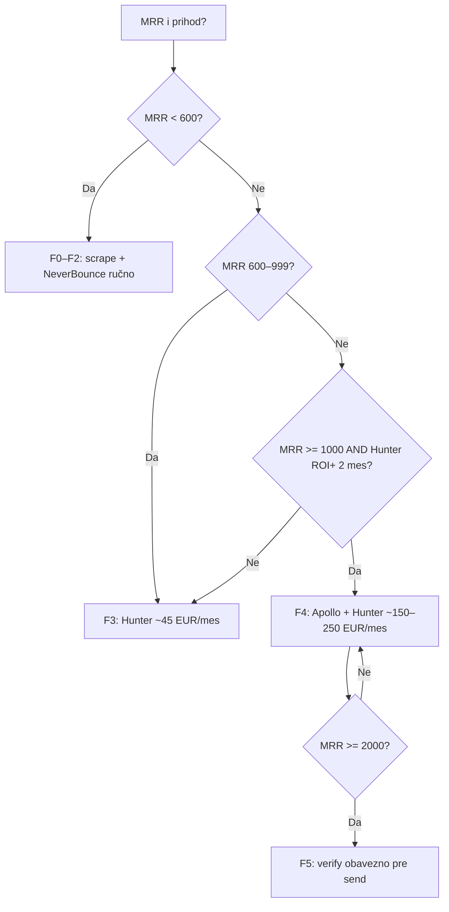

# Mesečni plan ulaganja — M0 → M6 (personalizovano)

**Kontekst:** domen + VPS već plaćeni · manual IBAN (M0) · prod `omnigrouptech.com` live · gate pre skupe alate = **prihod pokriva trošak**.

**Legenda modula:** ● uključi · ○ opciono · — off

---

## Ciljni MRR (referenca)

| Nivo | MRR / mes | Šta unlock-uje |
|------|-----------|----------------|
| **R0** | €0 | M0–M1 (inbound only) |
| **R1** | €200+ | M2 scraper + outbound draft |
| **R2** | €400+ | M3 retainer upsell, pun E2E |
| **R3** | €600+ | Lead **F3** (Hunter) — gate checklist ~€200 alata |
| **R4** | €1.000+ | Lead **F4** (Apollo) + outreach send pun gas |
| **R5** | €1.500+ | M5 autonomy reinvest (cap €10/dan) |
| **R6** | €2.000+ | M6 Stripe live + HeyGen + Lead F5 |

*MRR = subscription + retaineri (support-priority €199, vertical €179, lead-gen €349…). Jednokratni setup ne ulazi u MRR ali ubrzava gate.*

---

## Pregled 12 meseci

| Mes | Faza | Moduli ● | Uložak sistem €/mes | Marketing €/mes | Ukupno €/mes | Gate (pre sledećeg meseca) |
|-----|------|----------|---------------------|-----------------|--------------|----------------------------|
| **1** | M0 | billing, fulfillment, web | 20–45 | 0–50 | **20–95** | 1× potvrđena uplata |
| **2** | M1 | + crm, notifications, contact→CRM | 20–45 | 0–100 | **20–145** | Resend live + 1 lead u CRM |
| **3** | M2 | + hunter draft, scraper F1, outreach draft | 50–125 | 0–100 | **50–225** | 10 draftova + warmup start |
| **4** | M2→M3 | + retainer cron, public-site content | 55–155 | 50–150 | **105–305** | 2× fulfilled paket |
| **5** | M3 | + shop manual, solutions sync | 55–155 | 50–200 | **105–355** | 3× fulfilled + api DNS OK |
| **6** | M3→M4 | + lead F2 verify (NeverBounce) | 70–180 | 100–250 | **170–430** | MRR ≥ €400 **ili** €800 prihod u 60d |
| **7** | M4 | + **Hunter F3**, outreach send (cap 20/d) | 200–280 | 200–400 | **400–680** | ROI lead > trošak Hunter |
| **8** | M4 | + hot-clients, titanis draft | 200–300 | 200–500 | **400–800** | ≥2 checkout/mes iz outbound |
| **9** | M4→M5 | + **Apollo F4** (ako MRR ≥ €1k) | 280–380 | 250–500 | **530–880** | MRR ≥ €1.000 |
| **10** | M5 | + autonomy-loop, reinvest 20% | 250–500* | 200–400 | **450–900** | revenue feedback OK |
| **11** | M5→M6 | + HeyGen/D-ID test | 300–550 | 250–600 | **550–1.150** | MRR ≥ €1.500 |
| **12** | M6 | + Stripe live, Lead F5, OmniTube ○ | 350–650 | 300–800 | **650–1.450** | Stripe webhook + auto checkout |

\* M5: deo troška ide iz **reinvest 20%** prihoda — neto iz džepa manji ako MRR raste.

---

## Mesec po mesec — detaljno

### Mesec 1 — M0 „Prva uplata“

**Paljenje**

| Modul | Status |
|-------|--------|
| payments, billing, fulfillment (17) | ● |
| marketing web, pricing, manual checkout | ● |
| outreach, lead DB, autonomy | — |

**Env:** `PAYMENTS_MODE=manual`, IBAN, `ALLOW_MANUAL_PAYMENTS_IN_PRODUCTION=true`

**Uložak:** OpenRouter €15–25 · Resend €0 · Telegram €0

**Marketing:** 0–50 € (opciono mali LinkedIn boost) · fokus **warm kontakti**, ne ads

**Tvoj posao:** DNS `api.omnigrouptech.com` · popuni CRM ingress · prva **Confirm** u adminu

**Gate → mes 2:** bar **1 potvrđena uplata** (setup-quick ~€290–390 idealno)

---

### Mesec 2 — M1 „Inbound“

**Paljenje**

| Modul | Status |
|-------|--------|
| crm, notifications | ● |
| contact → Resend + CRM ingress | ● |
| Slack / Telegram ping | ● |
| client-hunter send | — |

**Uložak:** isti kao M0 (€20–45)

**Marketing:** €0–100 · SEO/LinkedIn · kontakt forma live

**Gate → mes 3:** `test-contact-resend.ps1` PASS · **≥1 lead** u CRM/inbox

---

### Mesec 3 — M2 „Warm outbound“

**Paljenje**

| Modul | Status |
|-------|--------|
| client-hunter, scraper | ● |
| outreach **draft only** | ● |
| `LEAD_DATABASE_PHASE=F1` | ● |
| outreach send | — |

**Env:** `ENABLE_SCRAPER=true`, `OUTREACH_WARMUP_MODE=true`, `OUTREACH_DAILY_CAP=20`

**Uložak:** + Apify/scraper **€20–50** · OpenRouter +€10

**Marketing:** €0–100 · case study iz mes 1 projekta (ako imaš)

**Gate → mes 4:** **≥10 draftova** u queue · email warmup u toku

---

### Mesec 4 — M2/M3 „Isporuka vrednosti“

**Paljenje**

| Modul | Status |
|-------|--------|
| retainer-scheduler | ● |
| public-site (stvarni sadržaj posle fulfillment) | ● |
| shop manual path | ○ |

**Uložak:** €55–155 sistem

**Marketing:** €50–150 · retargeting · upsell postojećim klijentima

**Gate → mes 5:** **2× fulfilled** paket sa checklist PASS

---

### Mesec 5 — M3 „Upsell & MRR“

**Paljenje:** isti stack · fokus na **retainer** (support-priority €199, vertical €179)

**Uložak:** €55–155

**Marketing:** €50–200

**Gate → mes 6 (M4 priprema):**

- [ ] **3× fulfilled** na prod  
- [ ] `api.omnigrouptech.com` DNS OK  
- [ ] **MRR ≥ €400** *ili* **€800 prihod** u poslednjih 60 dana  

---

### Mesec 6 — M4 priprema (verify, bez Apollo)

**Paljenje**

| Modul | Status |
|-------|--------|
| Lead **F2** + NeverBounce | ● |
| auto-enrich | — |
| Hunter / Apollo | — |

**Env:** `LEAD_DATABASE_ENABLED=true`, `PHASE=F2`, `NEVERBOUNCE_API_KEY=...`

**Uložak:** + verify **€10–30** → ukupno **€70–180**

**Marketing:** €100–250 · outbound **još ne mas send** na hladne liste

**Gate → mes 7:** MRR ≥ **€600** *ili* odluka da Hunter trošak (~€45) pokriva **1 mali deal/mes**

---

### Mesec 7 — M4 start: **Hunter (F3), ne Apollo**

**Zašto Hunter pre Apollo:** jeftiniji (~€45/mes), dovoljan za enrich po domenu; Apollo tek kad pipeline stabilan.

**Paljenje**

| Modul | Status |
|-------|--------|
| `LEAD_DATABASE_PHASE=F3` | ● |
| `HUNTER_API_KEY` (+ opciono Snov) | ● |
| outreach send | ● (cap 20/dan) |
| titanis | ○ read-only |
| Apollo | — |

**Env:**

```env
LEAD_DATABASE_ROLLOUT_PHASE=F3
HUNTER_API_KEY=...
OUTREACH_WARMUP_MODE=false
OUTREACH_DOMAIN_WARMUP_COMPLETE=true
OUTREACH_DAILY_CAP=20
```

**Uložak:** €200–280 (Hunter + verify + AI + scraper)

**Marketing:** €200–400 B2B

**KPI meseca:** ≥20 enriched leads/ned · reply rate ≥2% · **≥1 checkout** iz outbound

**Gate → mes 8:** prihod od hunt kanala **>** Hunter + verify (~€55)

---

### Mesec 8 — M4 produbljivanje

**Paljenje:** + hot-clients, lead-scoring, titanis/follow-up **●**

**Uložak:** €200–300 · marketing €200–500

**Gate → mes 9:** **≥2 manual checkout/mes** · CRM **≥50** kontakata sa emailom

---

### Mesec 9 — **Apollo (F4)** — samo ako MRR ≥ €1.000

**Decision rule:**

```
IF MRR >= 1000 EUR AND Hunter ROI positive for 2 months
  → LEAD_DATABASE_ROLLOUT_PHASE=F4
  → APOLLO_API_KEY=...
  → OUTREACH_DAILY_CAP=50
ELSE
  → ostani na F3 + Hunter, ne pali Apollo
```

**Paljenje**

| Modul | Status |
|-------|--------|
| Apollo F4 | ● (uslovno) |
| auto verify on hunt | ● |

**Uložak:** €280–380 (+ Apollo €45–90)

**Gate → mes 10:** ROI lead spend > 1.0 · MRR ≥ **€1.000**

---

### Mesec 10 — M5 Autonomy reinvest

**Paljenje**

| Modul | Status |
|-------|--------|
| autonomy-loop scheduler | ● |
| autonomy-marketing | ● |
| `AUTONOMY_REVENUE_REINVEST_RATE=0.2` | ● |
| `AUTONOMY_MAX_SPEND_PER_DAY_USD=10` | ● |

**Uložak:** €250–500 (cap); **~€50–150 neto iz džepa** ako reinvest pokriva ostatak

**Gate → mes 11:** `GET /autonomy-loop/status` OK · marketing spend log realan

---

### Mesec 11 — M5→M6 priprema

**Paljenje:** HeyGen **ili** D-ID (test) · ○ OmniTube

**Uložak:** +€25–80 avatar

**Gate → mes 12:** MRR ≥ **€1.500** · firma spremna za Stripe

---

### Mesec 12 — M6 Pun gas

**Paljenje**

| Modul | Status |
|-------|--------|
| Stripe live + webhooks | ● |
| Lead **F5** (verify obavezno) | ● |
| HeyGen/D-ID produkcija | ● |
| `PAYMENTS_MODE=live` | ● |

**Uložak:** €350–650 + Stripe **2.9% + €0.25**/tx

**Marketing:** €300–800

---

## Hunter vs Apollo — brza odluka



| Pitanje | Hunter F3 | Apollo F4 |
|---------|-----------|-----------|
| Minimalni MRR | **€600+** | **€1.000+** |
| Mesečni trošak | **~€45** | **+€45–90** |
| Šta dobijaš | email po domenu, enrich | people search, veći volume |
| Rizik | nizak | srednji — ne pali bez ROI |

---

## Kumulativ ulaganje (realistična putanja A)

Pretpostavka: ne preskačeš gate-ove; MRR raste sa 0 → €1.500 do mes 12.

| Do kraja meseca | Kumulativ sistem € | Kumulativ marketing € | **Ukupno €** |
|-----------------|-------------------|----------------------|--------------|
| 3 | 115–215 | 0–250 | **115–465** |
| 6 | 270–620 | 150–750 | **420–1.370** |
| 9 | 890–1.520 | 600–2.050 | **1.490–3.570** |
| 12 | 1.540–3.350 | 1.200–4.050 | **2.740–7.400** |

**Prvih 6 meseci (do Huntera):** planiraj **~€420–1.370 ukupno** (sistem + blagi marketing).

---

## Checklist „šta palim ovog meseca“

Kopiraj u notes:

- [ ] **Mes 1:** M0 env · DNS api · prva uplata  
- [ ] **Mes 2:** Resend · CRM ingress · Slack/Telegram  
- [ ] **Mes 3:** SCRAPER_KEY · outreach draft · F1  
- [ ] **Mes 4–5:** retainer · 3× fulfilled · MRR track  
- [ ] **Mes 6:** NeverBounce F2 · **NE** Hunter još  
- [ ] **Mes 7:** Hunter F3 · send cap 20  
- [ ] **Mes 9:** Apollo F4 **samo ako** MRR ≥ €1k  
- [ ] **Mes 10:** autonomy reinvest  
- [ ] **Mes 12:** Stripe + F5  

---

## Povezano

- [`MARKETING-REVENUE-PHASED-CHECKLIST.md`](./MARKETING-REVENUE-PHASED-CHECKLIST.md)  
- [`ADMIN-STAVKE-M0-M1.md`](./ADMIN-STAVKE-M0-M1.md)  
- [`KLJUCEVI-PRIRUPLJANJE.md`](./KLJUCEVI-PRIRUPLJANJE.md)  
- [`LEAD-DATABASES-PHASED.md`](../atina-platform/atina/docs/operations/LEAD-DATABASES-PHASED.md)

*Ažuriraj gate redom kako prodaješ — preskoči mesec samo ako gate već PASS.*
