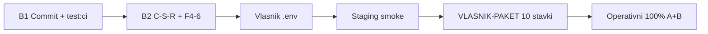

# Plan do 100% — ceo Omni Group monorepo

**Datum:** 2026-05-25  
**Cilj:** zatvoriti sve što projekat **definiše kao obavezno**; vision (K8s, 125k profila) je **odvojen product scope** — vidi [odjeljak 0](#0-dve-definicije-100).

**Trenutno (pre ovog plana):** CEO matrica **~85%** (58/68) · repo inženjering **~90%** · prod/live **~20%**.

---

## 0. Dve definicije „100%“

| Definicija | Šta uključuje | Realan cilj |
|------------|---------------|-------------|
| **A — Operativni 100%** | [`CHECKLIST-CEO-SISTEM.md`](../CHECKLIST-CEO-SISTEM.md) sekcije **A–H** sve `[x]` + dokazi Pass | **Da** — [`VLASNIK-PAKET.md`](./VLASNIK-PAKET.md) (1–3 dana rada vlasnika) |
| **B — Inženjerski 100%** | Gate zelen, WIP commitovan, C-S-R dug, F4-6, E2E jedan tok, migracije | **Da** — agent + vlasnik `.env` |
| **C — PDF + vision 100%** | K8s, swarm, stranični aligned za svaki PDF | **Ne u ovom repou** bez novog product brief-a — [`NIVO-3-VISION-K8S-AI.md`](./NIVO-3-VISION-K8S-AI.md) |

**Ako kažeš „sve na 100%“ bez izuzetka:** prihvati **A + B** kao zvanični kraj; **C** = P15 opciono ili novi projekat.

---

## 1. Blokator mapa (10 + 3 stuba)

### 1.1 Vlasnik — bez ovoga nema operativnog 100% (P14)

Redom: [`VLASNIK-PAKET.md`](./VLASNIK-PAKET.md)

| # | Stavka | Dokaz |
|---|--------|-------|
| 1 | GitHub `main` + PR | [`GIT-A-EVIDENCE-LATEST.md`](./GIT-A-EVIDENCE-LATEST.md) |
| 2 | Nest prod `TYPEORM_SYNC=false` + migracije | [`TYPEORM-PROD-EVIDENCE-LATEST.md`](./TYPEORM-PROD-EVIDENCE-LATEST.md) |
| 3–10 | CEO G: build prod, staging migracije, prod `.env`, live plaćanja, SMTP, `smoke:all` na prod URL, admin, rollback | [`CEO-G-PRODUCTION-EVIDENCE-LATEST.md`](./CEO-G-PRODUCTION-EVIDENCE-LATEST.md) |

**Env (u izradi):** [`VLASNIK-SAKUPLJANJE-KLJUCEVA.md`](./VLASNIK-SAKUPLJANJE-KLJUCEVA.md) · provera: `.\scripts\check-atina-aggregators.ps1` · `.\scripts\check-stripe-env.ps1`

### 1.2 Agent / repo — pre push-a na `main`

```powershell
cd "c:\Users\Marko Kosic\OneDrive\Desktop\omni group"
# 1) Stage bez .env
git add -A
git reset atina-platform/atina/.env
# 2) Gate
cd atina-platform\atina
npm run build
npm run test:ci
npm run migrate
cd ..\..
python -m pytest -q
cd atina-system
npm run verify:n1
# 3) Pun mirror (disk ≥5 GB) — [`verify-monorepo.ps1`](../scripts/verify-monorepo.ps1) (job **Python (Doslednost dok + pytest)** — [`GIT-BRANCH-PROTECTION.md`](./GIT-BRANCH-PROTECTION.md); uključuje **apps/omnigroup-web** osim **`-SkipOmnigroupWeb`**; posle servisa **`npm run smoke:all`** u `atina-platform/atina`)
cd ..
.\scripts\verify-monorepo.ps1
```

### 1.3 N2 red 0.3 (opciono ali preporučeno)

Zelen **CI (monorepo)** na svakom merge-u → [`CI-GREEN-ON-MAIN.md`](./CI-GREEN-ON-MAIN.md) · [`N2-0-3-EVIDENCE-LATEST.md`](./N2-0-3-EVIDENCE-LATEST.md)

---

## 2. Inženjerski 100% (B) — checklista

Označi `[x]` kad je zatvoreno.

### Faza B1 — Isporuka koda (1–2 dana)

- [x] Commit + push celog Titan audita (~100+ fajlova), **bez** `.env` — `7df6ca2`, `9d30be7`, `7c319dd` na `main`
- [x] `011_system_alerts.sql` primenjena na **dev** (tabela `system_alerts`; staging/prod još ne)
- [x] `npm run test:ci` **PASS** lokalno posle `7c319dd` — **3257/3257** (2026-06-02)
- [x] Novi Val u [`NIVO-1-VERIFY-MONOREPO-EVIDENCE-LATEST.md`](./NIVO-1-VERIFY-MONOREPO-EVIDENCE-LATEST.md) — **Val 360** / 2026-06-03, pun mirror exit 0 (posle `38285be`)

### Faza B2 — Dug u kodu (niski prioritet → 100% čistoće)

- [x] C-S-R: ~~`self-healing`~~, ~~`ai-memory`~~, ~~`kpi`~~, ~~`recommendation`~~ (repository umesto `query()` u service) — **`ai-memory`**, **`kpi`**, **`recommendation`**, **`self-healing`** audit, **`auth.service`**, **`payments.service`** `[x]` 2026-06-03
- [x] `auth.service` — audit insert u repository (`AuthRepository.insertBootstrapAudit`)
- [x] `payments.service` — imenovane repo metode umesto generičkog `execute()`
- [x] `admin.service` split — onboarding izdvojen u `admin-onboarding.service.ts` (~730 linija); `admin.service.ts` ~662 linija

### Faza B3 — Front + F4-6

- [x] Resend kontakt live (`apps/omnigroup-web/.env.local` + `test-contact-resend.ps1`) — 2026-06-02, `sent_via_resend`
- [x] Dashboard bez demo kada je prava sesija + Atina API — `dashboard/page.tsx` koristi `fetchAtinaDashboardLive` kad `!session.demo`; E2E billing sa `admin@atina.io` prolazi
- [x] F4-6: upload spike dokumentovan + minimal ruta ([`FAZA-4-F4-6-NEXT.md`](./FAZA-4-F4-6-NEXT.md)) — [`F4-6-UPLOAD-SPIKE.md`](./F4-6-UPLOAD-SPIKE.md), `POST /api/upload`, `test-upload-spike.ps1` PASS
- [x] Admin/Dashboard UI — `AdminClient` / `DashboardClient` sa live BFF podacima; `owner-smoke-all` PASS (2026-06-03)

### Faza B4 — E2E (N2)

- [x] Jedan automatizovan tok (npr. register → plan → payment stub) — [`e2e-register-plan-payment.ps1`](../scripts/e2e-register-plan-payment.ps1) · `npm run e2e:register` u web (2026-06-03 PASS)

### Faza B5 — PDF folder

- [x] PDF trag — binarni fajlovi van Gita; kanonski izvor [`docs/nivo3-wave-a/`](./nivo3-wave-a/) + [`sve/README.md`](../sve/README.md) (2026-06-03)

---

## 3. Operativni 100% (A) — jedan dan vlasnika

| Red | Akcija | Posle uspeha |
|-----|--------|--------------|
| 1 | Popuni `.env` (FINANCE, AI, COMMS minimum) | `check-atina-aggregators` + `check-stripe-env` = PASS |
| 2 | `staging-preflight.ps1` (lokalno) → staging deploy + migrate + `staging-smoke-remote.ps1` | Upis u CEO-G evidenciju (staging sekcija) |
| 3 | Korak 1–3 iz [`VLASNIK-PAKET.md`](./VLASNIK-PAKET.md) | 10 × `[ ]` → `[x]` u CEO matrici |
| 4 | Prod cutover + smoke na prod URL | CEO G Pass |
| 5 | Ažuriraj [`COMPLETE-SYSTEM-PLAN-AND-CHECKLIST.md`](./COMPLETE-SYSTEM-PLAN-AND-CHECKLIST.md) odjeljak 0 na **100%** | — |

---

## 4. Procena posle zatvaranja

| Sloj | Posle A+B |
|------|-----------|
| CEO A–H | **100%** |
| Repo gate | **100%** (lokalno + CI) |
| Live SaaS | **100%** (staging + prod sa ključevima) |
| Vision/K8s | **N/A** ili P15 — ne ulazi u A+B |

---

## 5. Redosled (mermaid)



---

## Reference

| Dokument | Uloga |
|----------|--------|
| [`MASTER-FINAL-ROADMAP.md`](./MASTER-FINAL-ROADMAP.md) P14 | Finalni kraj CEO |
| [`CEO-OPEN-BULLETS-RUNBOOK.md`](./CEO-OPEN-BULLETS-RUNBOOK.md) | 10 otvorenih stavki |
| [`AGENT-CHECKLIST-KOMPLET.md`](./AGENT-CHECKLIST-KOMPLET.md) | Agent opseg (zatvoren) |
| [`RECOVER-DISK-AND-CI.md`](./RECOVER-DISK-AND-CI.md) | Disk + CI recovery |
