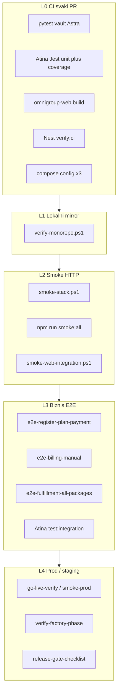

# Kompletan plan testiranja — Omni Group

Kanonski operativni plan za **ceo monorepo**: Atina SaaS, Nest, Next.js web, Python Astra/Forge/vault, compose i prod. Koristi postojeće Jest / pytest / PowerShell gate-ove. Kaže **šta**, **kada**, **kojom komandom** i **šta još fali**.

**V1:** bez Playwright/Cypress — web ostaje na `build` + PowerShell smoke/e2e.

Povezano: [`scripts/README.md`](../scripts/README.md) · [`SYSTEM-MAP.md`](../SYSTEM-MAP.md) · [`CONTRIBUTING.md`](../CONTRIBUTING.md) · [`NIVO-1-START.md`](../NIVO-1-START.md) · [release-gate-checklist](../atina-platform/atina/docs/operations/release-gate-checklist.md) · [FULFILLMENT-17-PACKAGE-CHECKLIST](./FULFILLMENT-17-PACKAGE-CHECKLIST.md) · [STAGING-RELEASE-CHECKLIST](./STAGING-RELEASE-CHECKLIST.md) · [GIT-BRANCH-PROTECTION](./GIT-BRANCH-PROTECTION.md). Lokalni CI mirror: [`verify-monorepo.ps1`](../scripts/verify-monorepo.ps1) (job **`python`** / required check **`Python (Doslednost dok + pytest)`** — [`GIT-BRANCH-PROTECTION.md`](./GIT-BRANCH-PROTECTION.md)). **Monorepo evidencija (indeks + dry-run):** [`EVIDENCE-INDEX.md`](./EVIDENCE-INDEX.md) · [`NIVO-1-DRYRUN-LOG.md`](./NIVO-1-DRYRUN-LOG.md).

---

## 1. Piramida L0–L4



| Nivo | Kada | Blokira release? |
|------|------|------------------|
| L0 | Svaki PR / push | Da (branch protection) |
| L1 | Pre merge / lokalno | Da (mirror CI) |
| L2 | Pre staging deploy | Da |
| L3 | Pre prod / major feature | Da za billing / auth / fulfillment |
| L4 | Posle deploy | Da (GO / NO-GO) |

---

## 2. Stack mapa

| Stack | Put | Automatizacija danas | Gap |
|-------|-----|----------------------|-----|
| Atina SaaS API | `atina-platform/atina` | ~370 Jest (unit + integration), `smoke:all`, coverage gate | Fulfillment / factory-phase-auto / autonomy / product-factory delom **isključeni** iz `collectCoverageFrom` |
| Nest API | `atina-system` | ~32 unit + 1 e2e, `verify:ci` | Tanki e2e; Redis/queue samo opciono |
| OmniGroup Web | `apps/omnigroup-web` | `build` + `test:atina` normalize + PS smoke/e2e | Nema Jest/Vitest; marketing/BFF bez unit |
| Python | `src/` + `tests/` | 11 pytest (`pytest.ini` → `tests/`) | `sistem_naplate` van root `testpaths` |
| Compose / prod | root + nested compose | `docker compose config`, `docker-prod-test`, go-live | Ručno + PS |

---

## 3. L0 — CI (obavezno)

Workflow: [`.github/workflows/ci-monorepo.yml`](../.github/workflows/ci-monorepo.yml)

1. **Python** — `scripts/audit-doc-gate-references.ps1` → `python -m pytest`
2. **Atina SaaS** — build + lint + `atina-platform/atina/scripts/ci-unit-tests.sh` (unit + coverage; **bez** full integration u monorepo jobu)
3. **Web** — `npm run build` only
4. **Nest** — Postgres service → `npm run verify:ci`
5. **Compose** — `docker compose config` (Nest merge, Python root, Atina Node)

Lokalni mirror CI:

```powershell
powershell -NoProfile -ExecutionPolicy Bypass -File .\scripts\verify-monorepo.ps1
```

Opcioni switch-evi: `-SkipOmnigroupWeb`, `-SkipNestVerifyCi`, `-SkipCompose`, `-SkipDocAudit` (samo lokalno; CI i dalje radi doc gate). Detalji: [`scripts/README.md`](../scripts/README.md).

**DoD L0:** svi monorepo jobovi zeleni na PR-u.

---

## 4. L1 — Lokalni full verify (developer / pre-PR)

1. `.\scripts\verify-monorepo.ps1` (pun mirror)
2. Ako menjaš Atina DB / API / auth / billing / workflow: u `atina-platform/atina` → `npm run test:integration:local` (Postgres + migrate + integration)
3. Po potrebi consistency: `check-jest-config-consistency.ps1`, `check-docker-compose-consistency.ps1`, `check-pytest-config-consistency.ps1`

**DoD L1:** L0 zelen lokalno; integration zelen kad je dirnut billing / auth / workflow-chain.

Package CI (Atina nested): `atina-platform/atina/.github/workflows/ci.yml` — odvojeni integration job sa Postgres + migrate. Nest nested: `atina-system/.github/workflows/ci.yml`.

---

## 5. L2 — Smoke (servisi up)

Pretpostavka: stack podignut po [`NIVO-1-START.md`](../NIVO-1-START.md).

| Provera | Komanda | Pokriva |
|---------|---------|---------|
| Multi-stack health | `.\scripts\smoke-stack.ps1 -SkipNode:$false` | Astra `:8080`, Nest `:3001`, Atina `GET /health` |
| Atina dubinski | `cd atina-platform\atina; npm run smoke:all` | login, `/me`, Forge, admin |
| Web ↔ API | `.\scripts\smoke-web-integration.ps1` | BFF / marketing ↔ Atina |
| Hunting | `.\scripts\smoke-hunting-integration.ps1` | lead / hunting put |
| Platform full | `.\scripts\smoke-platform-full.ps1` | širi prolaz |
| Owner smoke | `.\scripts\owner-smoke-all.ps1` | vlasnički bundle |

Napomene:

- `smoke-stack.ps1` za Atina Node šalje samo `/health`. Dubinski gate = `npm run smoke:all`.
- Za Nest queue (dev): `.\scripts\smoke-stack.ps1 -NestQueueSmoke` — vidi [`atina-system/docs/QUEUE-SMOKE-DEV.md`](../atina-system/docs/QUEUE-SMOKE-DEV.md).
- Boolean preko `powershell -File`: koristi `-SkipNode:$false` (dvotačka).

**DoD L2:** kritični HTTP 2xx; JWT login radi; Forge vault writable (nema `SQLITE_READONLY`).

---

## 6. L3 — Biznis E2E (novčani tokovi)

Prioritetni redosled:

| # | Tok | Komanda / artefakt |
|---|-----|-------------------|
| 1 | Registracija → plan → plaćanje | `.\scripts\e2e-register-plan-payment.ps1` ili `apps/omnigroup-web` → `npm run e2e:register` |
| 2 | Billing manuelni prolaz | `.\scripts\e2e-billing-manual.ps1` / `npm run e2e:billing` |
| 3 | Fulfillment svih paketa | `.\scripts\e2e-fulfillment-all-packages.ps1` + [FULFILLMENT-17-PACKAGE-CHECKLIST](./FULFILLMENT-17-PACKAGE-CHECKLIST.md) |
| 4 | Revenue / resources | `.\scripts\e2e-revenue-and-resources.ps1` |
| 5 | Kontakt / email | `.\scripts\test-contact-resend.ps1` (kad je Resend konfigurisan) |
| 6 | Factory phase | `.\scripts\verify-factory-phase.ps1` + unit `factory-phase-*.test.ts` |
| 7 | Atina integration | `cd atina-platform\atina; npm run test:integration:local` |

Formalni Atina release gate (lint → unit → integration → smoke → post-deploy): [`release-gate-checklist.md`](../atina-platform/atina/docs/operations/release-gate-checklist.md). Nivo 2 E2E napomene: [`NIVO-2-E2E.md`](../atina-platform/atina/docs/operations/NIVO-2-E2E.md).

**DoD L3:** svi tokovi relevantni za release scope PASS; za prod koji dira pakete / plaćanja — fulfillment e2e obavezan.

---

## 7. L4 — Staging / produkcija

1. DNS: `.\scripts\verify-production-dns.ps1`
2. Staging: `.\scripts\staging-smoke-remote.ps1` + [STAGING-RELEASE-CHECKLIST](./STAGING-RELEASE-CHECKLIST.md) / [STAGING-LOCAL-PREFLIGHT-LATEST](./STAGING-LOCAL-PREFLIGHT-LATEST.md)
3. Post-deploy: `.\scripts\go-live-verify.ps1`, `.\scripts\smoke-prod-server.ps1`
4. Factory phase na produ: `.\scripts\prod-factory-phase.ps1` + `.\scripts\verify-factory-phase.ps1`
5. Evidencija: ažurirati LATEST smoke/verify dokove po Val procesu u [`scripts/README.md`](../scripts/README.md) (*Kad podigneš novi broj*)
6. Rollback / smoke matrice: [`deploy-rollback-checklist.md`](../atina-platform/atina/docs/operations/deploy-rollback-checklist.md)

**GO samo ako** svi REQUIRED gate-ovi u release-gate checklisti imaju PASS + evidence (version/tag, commit SHA, timestamp, log).

---

## 8. Matrica kritičnih domena

| Domen | Unit | Integration | Smoke / E2E | Gate owner |
|-------|------|-------------|-------------|------------|
| Auth / session | Atina + Nest | `auth.integration.test.ts` | `smoke:auth`, register e2e | Dev |
| Billing / plans / invoices | Atina billing tests | workflow-chain + billing e2e | `e2e-billing-manual.ps1` | QA |
| Payments (Stripe itd.) | payments unit | — | register/payment e2e (test keys) | QA |
| Factory-phase / fulfillment | `factory-phase-*.test.ts` (+ ciljani unit za excluded servise — backlog) | — | `e2e-fulfillment-all-packages.ps1`, `verify-factory-phase.ps1` | Release |
| Forge / vault | Python pytest + forge smoke | `titan-forge.failure.integration.test.ts` | `smoke:forge:*` | Dev |
| CRM / hunting | gusto unit | — | `smoke-hunting-integration.ps1` | Dev |
| Autonomy / product-factory | delimično; moduli excluded iz coverage | — | `smoke:category-rollout`, `smoke:product-factory` | Dev |
| Web marketing / BFF | skoro ništa (`test:atina` normalize) | — | `smoke-web-integration.ps1` + `build` | Dev |
| Nest supply / CRM / billing | `*.spec.ts` | `test:e2e` | `smoke-stack.ps1` Nest | Dev |
| Workflow-chain | unit + dedicated integration suite | `workflow-chain.*.integration.test.ts` | deo `smoke:all` / forge admin | Dev |

---

## 9. Cheat sheet — kada šta pokrenuti

```powershell
# L0/L1 — svaki PR / lokalni mirror
.\scripts\verify-monorepo.ps1

# L2 — pre staging (servisi up)
.\scripts\smoke-stack.ps1 -SkipNode:$false
cd atina-platform\atina; npm run smoke:all; npm run test:integration:local
cd ..\..\
.\scripts\smoke-web-integration.ps1

# L3 — pre prod (novac / paketi)
.\scripts\e2e-register-plan-payment.ps1
.\scripts\e2e-fulfillment-all-packages.ps1
.\scripts\verify-factory-phase.ps1

# L4 — posle deploy
.\scripts\go-live-verify.ps1
.\scripts\smoke-prod-server.ps1
```

Po stack-u (brzo):

```powershell
# Python
python -m pytest -q

# Atina SaaS
cd atina-platform\atina
npm run test:ci
npm run test:integration:local
npm run smoke:all

# Nest
cd atina-system
npm run verify:ci   # treba Postgres
npm run verify:n1   # build + unit only

# Web
cd apps\omnigroup-web
npm run build
npm run smoke:integration
npm run e2e:register
```

---

## 10. Backlog gapova (P0–P2) — šta još fali

Implementacija ovih stavki **nije** deo v1 dokumenta; ovo je prioritetni backlog za sledeće talase.

### P0 — Web (skoro bez unit)

- Minimalni testovi za kritične lib-ove: `apps/omnigroup-web/src/lib/brand.ts`, `client-offers.ts`, `sellable-packages.ts`, BFF normalize (`scripts/test-atina-normalize.mjs` proširiti ili Jest/Vitest).
- Proširiti [`scripts/smoke-web-integration.ps1`](../scripts/smoke-web-integration.ps1) asserts na pricing / contact / legal rute (`/(marketing)/pricing`, `contact`, `legal/privacy`, `legal/terms`).
- CI danas radi samo `npm run build` — smoke/e2e nisu u monorepo workflow-u.

### P0 — Fulfillment / factory-phase-auto (excluded iz coverage)

U [`atina-platform/atina/jest.config.js`](../atina-platform/atina/jest.config.js) `collectCoverageFrom` **isključuje** (Wave 4 + AUTO):

- `billing/service/deliverable-fulfillment.service.ts`
- `billing/service/deliverable-fulfillment-read.service.ts`
- `billing/service/deliverable-document-generator.service.ts`
- `billing/service/deliverable-content-generator.service.ts`
- `billing/service/client-deliverable-bootstrap.service.ts`
- `billing/service/fulfillment-memory.service.ts`
- `billing/service/deliverable-artifact-store.service.ts`
- `billing/service/factory-phase-auto.service.ts`
- `billing/lib/deliverable-handlers/**`
- `billing/lib/deliverable-catalog.ts`

Akcija: ciljani unit testovi (postoje delimično `factory-phase-auto.test.ts`, `factory-phase-effective.test.ts`, itd.) + postepeno skidanje exclusion-a; **obavezati** `e2e-fulfillment-all-packages.ps1` u L3 pre prod-a koji dira pakete.

Ostale Wave 2/3 exclusions (smoke-zavisno, unit wave pending):

- `modules/autonomy-loop/**`, `video-meetings/**`, `admin/**`, `ai-rag/**`, `alert-system/**`
- `modules/product-factory/**`, `public-site/**`, `cursor-agent/**`, `resource-procurement/**`
- `billing/service/revenue-allocation.service.ts`
- `integrations/lead-databases/**`, `lead-database.service.ts`, OpenRouter/Apify/Telegram/Kriptoman direct
- `workflow-chain.service.ts` (namerno integration-focused)

### P1 — Atina integration u monorepo CI

- Monorepo job `atina-saas` **ne** pokreće `test:integration` (samo unit via `ci-unit-tests.sh`).
- Integration živi u package workflow-u (`atina-platform/atina/.github/workflows/ci.yml`) i lokalno (`test:integration:local`).
- Akcija: dokumentovati kao obavezu pre merge-a billing/auth (već u L1 DoD) **ili** dodati opcioni monorepo job sa Postgres servisom.

### P1 — Nest e2e

- Trenutno: `atina-system/test/app.e2e-spec.ts` (tanak).
- Akcija: proširiti bar auth + health + jedan billing happy path; Redis/Bull ostaje opciono via `-NestQueueSmoke`.

### P2 — sistem_naplate

- Testovi: `sistem_naplate/tests/test_billing_scripts.py` (+ `conftest.py`).
- Root `pytest.ini` `testpaths = tests` — **ne** uključuje `sistem_naplate/`.
- Akcija: dodati u `testpaths` ili zaseban CI korak.

### P2 — Browser E2E

- Ne uvoditi Playwright/Cypress u v1.
- Reevaluate posle stabilizacije postojećih PS e2e (`e2e-register-plan-payment`, `e2e-billing-manual`, `e2e-fulfillment-all-packages`).

---

## 11. Definition of Done po nivou (sažetak)

| Nivo | PASS kriterijum |
|------|-----------------|
| L0 | CI monorepo zelen (python, atina-saas, omnigroup-web, atina-system, compose) |
| L1 | `verify-monorepo.ps1` zelen; integration ako je scope DB/API |
| L2 | `smoke-stack` + `smoke:all` + `smoke-web-integration` zeleni |
| L3 | Relevantni e2e + Atina release-gate lint/unit/integration/smoke |
| L4 | go-live / smoke-prod / factory-phase verify + evidencija + GO sign-off |

---

## 12. Evidencija

- Verify LATEST: [`NIVO-1-VERIFY-MONOREPO-EVIDENCE-LATEST.md`](./NIVO-1-VERIFY-MONOREPO-EVIDENCE-LATEST.md)
- Smoke LATEST: [`NIVO-1-SMOKE-EVIDENCE-LATEST.md`](./NIVO-1-SMOKE-EVIDENCE-LATEST.md)
- **Monorepo evidencija (indeks + dry-run):** [`EVIDENCE-INDEX.md`](./EVIDENCE-INDEX.md) · [`NIVO-1-DRYRUN-LOG.md`](./NIVO-1-DRYRUN-LOG.md)
- Sistem integracija (checklist): [`SYSTEM-INTEGRATION-CHECKLIST.md`](./SYSTEM-INTEGRATION-CHECKLIST.md)
