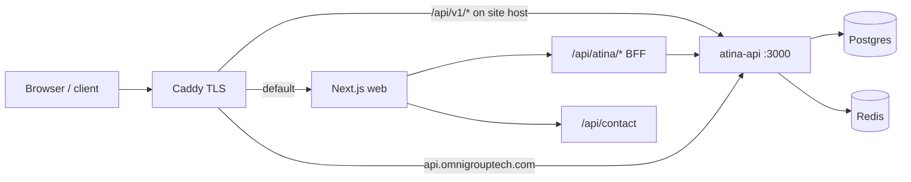

# Omni Group — Architecture Audit (Phase 2)

**Generated:** 2026-09-20  
**Phase:** 2 — read-only architecture review (no code changes)  
**Inputs:** [`system-inventory.md`](./system-inventory.md), [`../STATUS-KANON.md`](../STATUS-KANON.md), prod topology  
**Rule:** Findings only; remediation deferred to Phase 10+ after [`master-audit.md`](./master-audit.md).

---

## 1. Executive summary

Production is a **two-tier public surface**: Next.js (`apps/omnigroup-web`) as marketing + client UI + **BFF**, and **Atina Express API** (`atina-platform/atina`) as the system of record. Caddy terminates TLS and splits traffic by host and path. The design is coherent for MVP prod, but **surface area is large** (120+ BFF routes, 64 backend modules) with **dual API exposure** (same-origin BFF and direct `api.*` host).

| Strength | Risk / debt |
|----------|-------------|
| Clear prod compose boundary (postgres, redis, atina-api, web, caddy) | `atina-system` (Nest) parallel stack unused in prod — cognitive load |
| BFF centralizes browser auth cookies + CSRF for mutating calls | Many thin proxy routes — drift vs backend route auth |
| Factory phase + STATUS-KANON gate dangerous autonomy flags | Autonomy/outreach modules still present in same deployable as billing |
| Migrations + seed profiles for reproducible DB | No staging host — prod is the integration environment |

---

## 2. Request flow (production)

**Observations**

1. **Path split on marketing host:** `handle /api/v1/*` bypasses Next and hits Atina directly. Browser clients primarily use `/api/atina/*` (BFF), but automation or misconfigured clients could call `/api/v1/*` with different cookie/CORS semantics.
2. **API subdomain** exposes the full Express surface. Any route missing `authenticate` on the backend is reachable without going through BFF CSRF checks.
3. **Contact** is implemented only on Next (`/api/contact`), not on Atina — appropriate for public lead capture; CRM ingress is a separate HTTP call from the web container.

---

## 3. Application boundaries

### 3.1 Frontend (Next.js)

| Concern | Implementation | Audit note |
|---------|----------------|------------|
| Session | HTTP-only session cookie via `@/lib/auth-session` | BFF validates before admin/dashboard |
| CSRF | Double-submit cookie + `x-csrf-token` on non-exempt POST | `/api/contact` exempt (by design) |
| Rate limit | In-memory BFF limits for auth + contact | Resets on web container restart; not shared across replicas |
| Data fetching | Client components → `/api/atina/...` | No GraphQL; many REST proxies |

**Finding A-01 (medium):** BFF rate limiting is process-local. If web is ever scaled horizontally, limits become inconsistent unless moved to Redis or edge.

**Finding A-02 (low):** Large number of nearly identical BFF route files increases risk of **wrong proxy path** or **missing auth forward** on new endpoints.

### 3.2 Backend (Atina Express)

| Concern | Implementation | Audit note |
|---------|----------------|------------|
| Auth | JWT Bearer + optional `x-api-key` (hashed in DB) | API key path is appropriate for server-to-server |
| Modules | ~64 feature folders under `src/modules/` | Billing, payments, autonomy-loop, outreach, cursor-agent coexist |
| Scheduler | In-process autonomy scheduler on `atina-api` | Single container owns cron-like behavior |
| Migrations | SQL files, docker profile `setup` | Count documented in Phase 1 inventory |

**Finding A-03 (high — operational):** **Autonomy / outbound / evolution** modules share the same deployment artifact as customer billing. STATUS-KANON locks (`AUTONOMY_AUTO_DEPLOY=false`, cold send OFF) are env-dependent, not structural isolation.

**Finding A-04 (medium):** **atina-system** (NestJS, Bull, PDF/Titan scenarios) is a second backend narrative in-repo but **not** in `docker-compose.prod.yml`. New contributors may target the wrong service.

### 3.3 Python / auxiliary stacks

Root `docker-compose.yml` (forge, atina worker, Astra) and `tools/*` pipelines are **optional** and not part of the audited prod gate. Treat as dev/experimentation unless explicitly wired in VPS compose.

---

## 4. Data and integration architecture

| Store | Role | Coupling |
|-------|------|----------|
| Postgres | Users, billing, CRM, outreach queue tables, etc. | Single DB for all modules |
| Redis | Sessions, queues, cache | Shared instance |
| Resend | Transactional + contact email | Web + API env |
| Stripe | Test mode checkout (prod config) | Webhooks hit API |
| Slack | Contact + ops notifications | Webhook URLs in env (server-only) |
| Instantly / SMTP | Cold outreach | Gated by warmup + billing flags |

**Finding A-05 (medium):** **Single database** simplifies ops but means any schema migration affects billing and experimental modules together; no blast-radius separation.

**Finding A-06 (low):** External integrations are **env-key driven** with generated `EMPTY-KEYS.md` audit — good visibility; empty keys still allow code paths to no-op or stub.

---

## 5. Deployment and configuration

| Stage | Mechanism |
|-------|-----------|
| Local secrets | `deploy-secrets.local/deploy.config.json` (gitignored) |
| VPS sync | `deploy-from-local-secrets.ps1` → env files on server |
| Factory phase | `prod-factory-phase.ps1` / `deploy-config-env.ps1` can override outreach warmup |

**Finding A-07 (medium):** Factory phase scripts **mutate env semantics** post-template; documented fixes exist for warmup override, but this remains a **footgun** if deploy order changes.

**Finding A-08 (high — process):** **No staging** (`staging.omnigrouptech.com` deferred). Architecture validation and migration rehearsal happen against production stack.

---

## 6. Observability and ops hooks

| Mechanism | Location |
|-----------|----------|
| `/health` | Atina + Caddy route on site host |
| `audit-prod-autonomous.ps1` | DNS, Resend, contact, IMAP invoice, keys |
| `/dev/status` | Bundled STATUS-KANON + PROD-AUDIT (protected) |

**Finding A-09 (low):** Centralized tracing/metrics (infra/observability) not wired in prod compose — reliance on logs + scripted audits.

---

## 7. Recommended focus areas (for Phase 9 consolidation)

Not fixes — prioritization for master audit:

1. **Dual API exposure** (`/api/v1/*` vs BFF vs `api.*`) — document allowed client patterns; consider restricting public `/api/v1` to webhooks/health only if BFF is canonical for browsers.
2. **Autonomy module isolation** — structural vs env-only gates before P3-A04 cold send.
3. **BFF maintenance** — codegen or shared proxy helper to reduce 120+ route duplication.
4. **Staging environment** — minimum viable clone before P2 live payments.
5. **Deprecate or document atina-system** — single backend story for prod.

---

## 8. Phase 2 exit criteria

- [x] Prod request flow documented  
- [x] BFF vs direct API boundary assessed  
- [x] Module / deployable coupling noted  
- [x] Data store and integration coupling listed  
- [x] Deployment and factory-phase risks captured  
- [x] Findings tagged A-01 … A-09 (severity qualitative)

**Next:** Phase 3 security audit → [`security-audit.md`](./security-audit.md).
